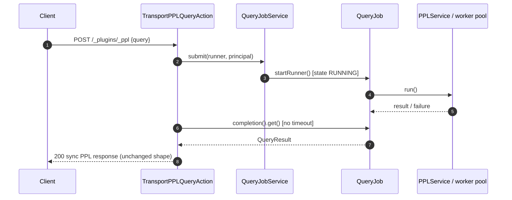
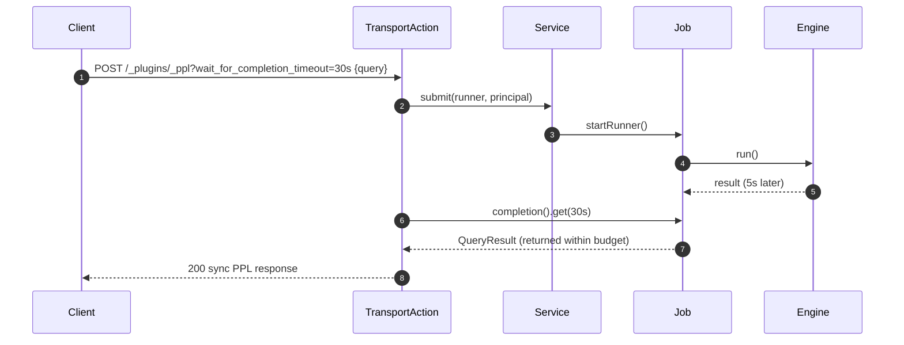
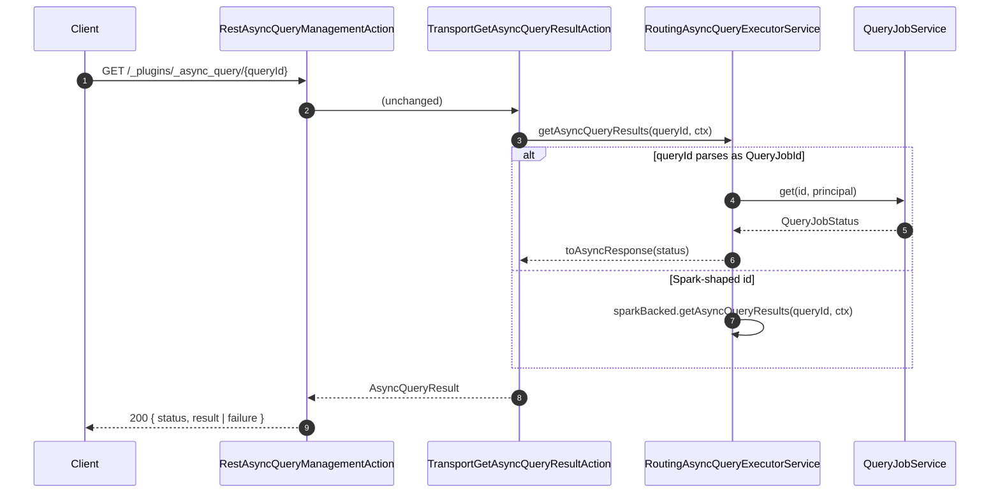
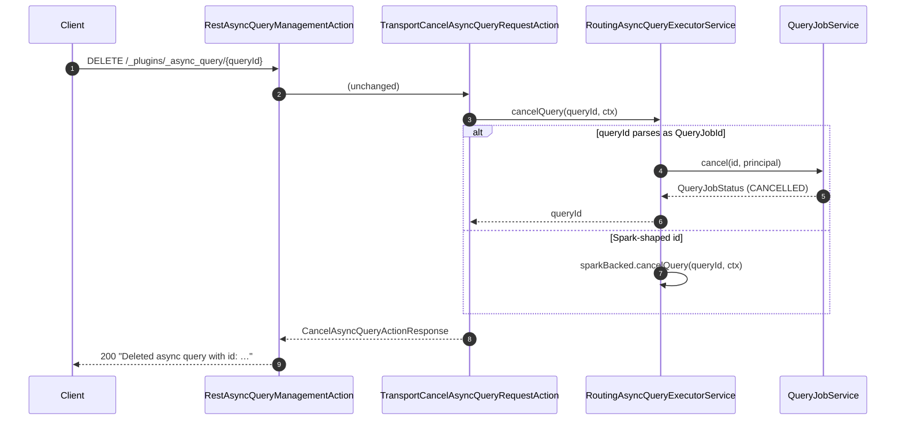

# Async Query Lifecycle — Follow-up Design

> Design-only. Builds on [opensearch-project/sql#5818](https://github.com/opensearch-project/sql/pull/5818) (`QueryJobService` / `QueryJob` / `QueryRunner` / `InMemoryQueryJobStore` / `OpenSearchQueryJobService`).

## 1. Context

`#5818` lands the neutral job lifecycle: interface, state machine, registry, tests. No REST wiring. This follow-up adds the wiring: a client can submit a query, receive a queryId, poll for the result, and cancel — reusing the existing `/_plugins/_async_query/{id}` GET/DELETE endpoints so **no new REST endpoint** is introduced.

## 2. Goals

1. Single endpoint (`/_plugins/_ppl`) accepts both sync and async submissions. The `wait_for_completion_timeout` parameter picks the mode.
2. Fetch and cancel reuse the existing `GET /_plugins/_async_query/{id}` and `DELETE /_plugins/_async_query/{id}` transport actions unchanged.
3. **Zero new REST endpoints. Zero new transport `ActionType`s.** AppSec footprint minimized.
4. Backwards compatible: clients that don't send `wait_for_completion_timeout` see the exact sync behavior they see today.

## 3. Non-goals for this PR

- `keep_alive` header (retention override per request).
- Persistent / cluster-visible job metadata.
- SQL, analytics-engine, direct-query as `QueryRunner`s (PPL only).
- Streaming / partial results.

## 4. Answers to the three open questions

### 4.1 How does routing work? What new transport actions are needed?

**No new transport actions.** No new `ActionType` names. The routing lives one layer below the transport action, inside `AsyncQueryExecutorService`.

Today the graph is:

```
POST /_plugins/_async_query    → RestAsyncQueryManagementAction
    → TransportCreateAsyncQueryRequestAction
        → AsyncQueryExecutorServiceImpl  ─► Spark / EMR-Serverless

GET /_plugins/_async_query/{id} → RestAsyncQueryManagementAction
    → TransportGetAsyncQueryResultAction
        → AsyncQueryExecutorServiceImpl  ─► Spark / EMR-Serverless

DELETE /_plugins/_async_query/{id} → RestAsyncQueryManagementAction
    → TransportCancelAsyncQueryRequestAction
        → AsyncQueryExecutorServiceImpl  ─► Spark / EMR-Serverless
```

After this follow-up:

```
POST /_plugins/_async_query    ─── unchanged ─── Spark path only
    (no in-JVM PPL submission on this endpoint)

GET /_plugins/_async_query/{id} → RestAsyncQueryManagementAction
    → TransportGetAsyncQueryResultAction               ← UNCHANGED
        → AsyncQueryExecutorService (interface)
            → RoutingAsyncQueryExecutorService         ← NEW class
                ├─ isQueryJobId(id)? → QueryJobService-backed adapter
                └─ else            → existing AsyncQueryExecutorServiceImpl

DELETE /_plugins/_async_query/{id} → RestAsyncQueryManagementAction
    → TransportCancelAsyncQueryRequestAction           ← UNCHANGED
        → AsyncQueryExecutorService (same router)
```

The router is a single new class:

```java
final class RoutingAsyncQueryExecutorService implements AsyncQueryExecutorService {
    private final AsyncQueryExecutorService sparkBacked;       // existing impl
    private final QueryJobService jobService;
    private final SecurityAdapter security;

    @Override
    public AsyncQueryExecutionResponse getAsyncQueryResults(String id, AsyncQueryRequestContext ctx) {
        return isJobServiceId(id)
            ? toAsyncResponse(jobService.get(QueryJobId.parse(id), security.current()))
            : sparkBacked.getAsyncQueryResults(id, ctx);
    }

    @Override
    public String cancelQuery(String id, AsyncQueryRequestContext ctx) {
        if (isJobServiceId(id)) {
            jobService.cancel(QueryJobId.parse(id), security.current());
            return id;
        }
        return sparkBacked.cancelQuery(id, ctx);
    }

    @Override
    public CreateAsyncQueryResponse createAsyncQuery(CreateAsyncQueryRequest r, AsyncQueryRequestContext ctx) {
        // Create on THIS endpoint stays Spark-only. In-JVM PPL submissions come in via /_plugins/_ppl.
        return sparkBacked.createAsyncQuery(r, ctx);
    }

    private static boolean isJobServiceId(String s) {
        try { QueryJobId.parse(s); return true; } catch (IllegalArgumentException e) { return false; }
    }
}
```

Guice change is a one-liner: bind `AsyncQueryExecutorService` → `RoutingAsyncQueryExecutorService` instead of directly to `AsyncQueryExecutorServiceImpl`.

**Why id-based routing is safe.** `QueryJobId.encode()` produces a versioned (`FORMAT_VERSION = 1`), length-prefixed, base64-url string. The parser rejects wrong version bytes, mismatched length prefixes, and trailing bytes. Spark job ids don't accidentally satisfy that layout. Worst case if an id somehow parses, the resolved `QueryJobId` doesn't exist in the in-memory store on this node → `QueryJobNotFoundException` → mapped to the same not-found response as the Spark path.

**Why not two transport actions.** New `ActionType` names (`cluster:admin/opensearch/ql/query_job/…`) may require AppSec review in environments where security roles enumerate action names rather than wildcarding on `cluster:admin/opensearch/ql/*`. That's the review this design avoids.

### 4.2 Submit — `wait_for_completion_timeout` behavior

Match the Elasticsearch async-search / BigQuery pattern: **one endpoint, sync and async are two values of one parameter**.

```
POST /_plugins/_ppl                                              → wait forever (current sync behavior)
POST /_plugins/_ppl?wait_for_completion_timeout=30s              → wait up to 30s; return result if done, otherwise return {queryId, isRunning:true}
POST /_plugins/_ppl?wait_for_completion_timeout=0                → return {queryId, isRunning:true} immediately (pure async)
```

Semantics:

| Parameter value | Behavior on server | Response shape |
|---|---|---|
| absent (default) | Wait until the runner terminates. | Current sync PPL response, unchanged. |
| `0` (or `0s`) | Do not wait for the runner. Publish the job, return immediately. | `{queryId, isRunning: true}` (matches existing async-query response shape). |
| positive duration | Wait up to that duration. If the runner terminates in time, return the sync result. Otherwise return the async response with the queryId. | Either the sync PPL response (unchanged) or `{queryId, isRunning: true}`. |

Implementation is one line at the transport layer:

```java
QueryJob job = queryJobService.submit(runner, security.current());
try {
    QueryResult result = job.completion()
        .toCompletableFuture()
        .get(timeout.millis(), TimeUnit.MILLISECONDS);
    // returned within budget → format as sync PPL response
    return syncResponse(result);
} catch (TimeoutException ignore) {
    // budget exceeded → return async response with queryId
    return asyncResponse(job.id());
}
```

`QueryJob` and `QueryJobService` need no changes; the timeout is a **submit-response behavior only**, not a lifecycle state.

Backwards compatibility: absent parameter → wait-forever branch → identical to today's PPL behavior. Old clients see nothing new.

Interim option: `?async=true`. Equivalent to `?wait_for_completion_timeout=0`. Cheaper to ship first. I recommend skipping and going straight to `wait_for_completion_timeout` since the semantics table above covers `async=true` as one row.

### 4.3 What is a "terminal state"?

The state machine has five values. Three are **terminal**:

| State | Terminal? | Meaning |
|---|---|---|
| `PENDING` | no | Submitted; runner not yet started. |
| `RUNNING` | no | Runner is executing. |
| `SUCCEEDED` | **yes** | Runner completed; `result` present. |
| `FAILED` | **yes** | Runner failed; `failure` present. |
| `CANCELLED` | **yes** | `cancel()` invoked before completion. |

Terminal semantics:

1. **State does not change after entering a terminal state.** `cancel()` on a terminal job is a no-op — the previous status is returned unchanged.
2. **`completedAtMillis` is present iff terminal.** (Enforced by the `QueryJobStatus` compact constructor.)
3. **`result` present iff `SUCCEEDED`; `failure` present iff `FAILED`.** (Also invariant-enforced.)
4. **`completion()` fires exactly once** — when the job first enters a terminal state.

Retention policy — how long a terminal job stays in the store — is orthogonal to state. See §5.

## 5. Retention model

MVP shipping model: **retain terminal jobs in memory for a fixed window (default 5 minutes) after entering the terminal state, then evict.**

Rationale:
- Clients need at least one successful GET to observe the terminal state → some retention is required.
- Unbounded retention is a memory leak.
- Fixed short window is the smallest thing that makes clients work without a new API surface.

Where it lives:

```java
final class RetentionPolicy {
    private final Duration ttl;
    private final Scheduler scheduler;   // ThreadPool.Scheduler

    void arm(QueryJob job) {
        job.completion().whenComplete((r, t) -> scheduler.schedule(
            () -> store.remove(job.id(), job), ttl.toMillis(), ...));
    }
}
```

`OpenSearchQueryJobService.submit()` invokes `retentionPolicy.arm(job)` right after `store.register(...)`. `QueryJob` itself gains no knowledge of retention — the timer lives at the service layer, exactly the "separate execution state from retention" principle from #5818 review.

Deferred: per-request `keep_alive` override, GET-refreshes-lease, cluster-visible eviction.

## 6. Component list

| New / changed | File | Role |
|---|---|---|
| **new** | `ppl/PPLQueryRunner.java` | `QueryRunner` impl over `PPLService.execute`. |
| **new** | `opensearch/OpenSearchSecurityAdapter.java` | `SecurityAdapter` reading `OPENSEARCH_SECURITY_USER_INFO_THREAD_CONTEXT` from `ThreadContext`. |
| **new** | `async-query/.../RoutingAsyncQueryExecutorService.java` | Id-shape router in front of the existing Spark impl (see §4.1). |
| **new** | `opensearch/.../RetentionPolicy.java` | Timer that evicts terminal jobs after TTL. |
| **edit** | `plugin/config/OpenSearchPluginModule.java` | Guice: bind `QueryJobService`, `QueryJobStore`, `SecurityAdapter`, `RetentionPolicy`; rebind `AsyncQueryExecutorService` to the router. |
| **edit** | `plugin/transport/TransportPPLQueryAction.java` | New submit branch: parse `wait_for_completion_timeout`, submit through `QueryJobService`, return sync or async response based on whether the future completes within budget. |
| **new** | `integ-test/.../AsyncQueryLifecycleIT.java` | Submit → poll GET → observe terminal state; submit → DELETE → observe CANCELLED; sync default behavior unchanged. |
| **new** | `docs/user/ppl/interfaces/wait_for_completion_timeout.rst` | User-facing doc. |

## 7. Sequence diagrams

### 7.1 Sync submit (default — `wait_for_completion_timeout` absent)



### 7.2 Async submit (`wait_for_completion_timeout=0`)

```mermaid
sequenceDiagram
    autonumber
    participant Client
    participant TransportAction
    participant Service
    participant Job

    Client->>TransportAction: POST /_plugins/_ppl?wait_for_completion_timeout=0 {query}
    TransportAction->>Service: submit(runner, principal)
    Service-->>TransportAction: QueryJob
    TransportAction-->>Client: 200 { queryId, isRunning:true }
    Note over Client,Job: Runner keeps going on worker thread; job is retained under queryId.
```

### 7.3 Hybrid submit (`wait_for_completion_timeout=30s`, runner beats budget)



### 7.4 Hybrid submit (`wait_for_completion_timeout=30s`, budget expires first)

```mermaid
sequenceDiagram
    autonumber
    participant Client
    participant TransportAction
    participant Service
    participant Job
    participant Engine

    Client->>TransportAction: POST /_plugins/_ppl?wait_for_completion_timeout=30s {query}
    TransportAction->>Service: submit(runner, principal)
    Service->>Job: startRunner()
    Job->>Engine: run()
    TransportAction->>Job: completion().get(30s)
    Note over TransportAction: 30s elapse, runner still going
    TransportAction-->>Client: 200 { queryId, isRunning:true }
    Note over Job,Engine: Runner continues; client re-fetches via GET.
```

### 7.5 Fetch after async submit (existing endpoint, routed)



### 7.6 Cancel after async submit (existing endpoint, routed)



## 8. Compatibility matrix

| Client behavior | Sync (today) | Sync (after this PR, no param) | Async |
|---|---|---|---|
| POST `/_plugins/_ppl` (no param) | 200 sync response | **200 sync response (unchanged)** | n/a |
| POST `/_plugins/_ppl?wait_for_completion_timeout=0` | n/a (param unknown → error today, or ignored) | **200 { queryId, isRunning:true }** | n/a |
| POST `/_plugins/_ppl?wait_for_completion_timeout=30s` | n/a | **200 sync response** (if done in 30s) or **200 { queryId, isRunning:true }** | n/a |
| GET `/_plugins/_async_query/{spark_id}` | 200 Spark result | 200 Spark result | **unchanged** |
| GET `/_plugins/_async_query/{ppl_query_job_id}` | n/a | n/a | **200 job status** |
| DELETE `/_plugins/_async_query/{spark_id}` | 200 | 200 | **unchanged** |
| DELETE `/_plugins/_async_query/{ppl_query_job_id}` | n/a | n/a | **200 job status (CANCELLED)** |

## 9. Test plan

Unit:
- `RoutingAsyncQueryExecutorServiceTest` — id-shape routing (positive/negative cases, spark-shape fallback, not-found translation).
- `TransportPPLQueryActionAsyncTest` — sync path unchanged; async path returns queryId; hybrid path resolves sync then async correctly.
- `RetentionPolicyTest` — job evicted after TTL; not evicted before; cancelled job also evicted.
- `OpenSearchSecurityAdapterTest` — principal captured; UNSECURED when no security context.

Integration:
- `AsyncQueryLifecycleIT` — submit `wait_for_completion_timeout=0` → poll GET until terminal → assert result matches sync run.
- `AsyncQueryLifecycleIT` — submit `wait_for_completion_timeout=30s` on a slow query → verify async response returned within timeout+ε.
- `AsyncQueryLifecycleIT` — submit `wait_for_completion_timeout=0` → DELETE → GET returns CANCELLED.
- `AsyncQueryLifecycleIT` — default submit still returns sync response with identical body.

## 10. Open questions

1. Response shape when a queryId's job has been evicted after TTL — 404 or a `state: EXPIRED` snapshot?
2. Should `?wait_for_completion_timeout` also apply to explain / analyze paths, or only plain query? I lean plain query only for MVP.
3. Should the retention TTL be a cluster setting from day one, or a hard-coded 5m constant with a follow-up setting? Cluster setting is small extra surface but AppSec-lite.

## 11. Follow-ups after this PR

- `keep_alive` per-request override.
- SQL and analytics-engine `QueryRunner` implementations.
- Persistent cluster-visible `QueryJobStore` (system-index).
- Admission control (`maxRunningQueries`).
- Partial-result streaming.
