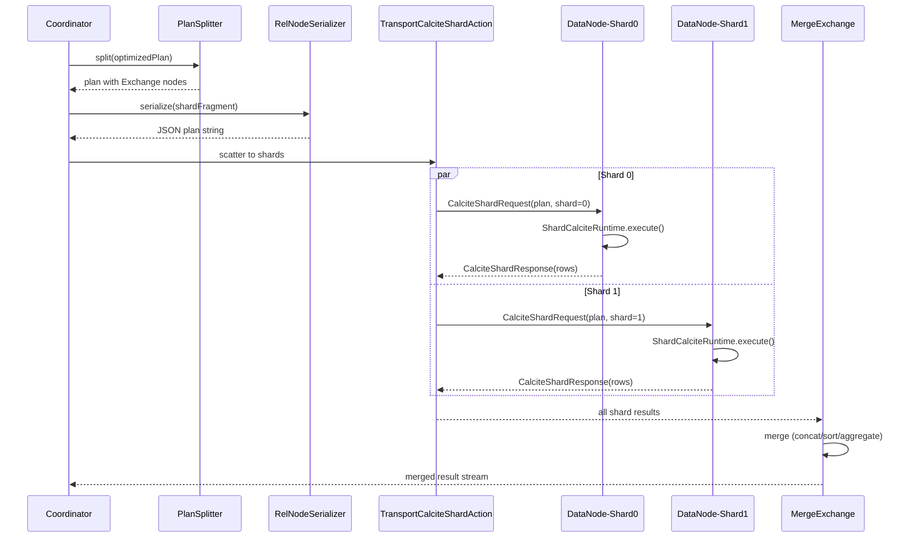

# Distributed Query Engine (DQE) — Phase 1 Design

---
## 1. Overview

This document describes the Distributed Query Engine (DQE) for PPL, which ships
Calcite plan fragments to data nodes and runs Calcite Enumerable pipelines directly
on shards. The architecture was produced through two rounds of structured debate
documented in [`brainstorm.md`](../../brainstorm.md).

Phase 1 solves three fundamental problems in the current PPL query engine, deletes
all 15 pushdown rules, and introduces six new components while keeping the existing
PPL → AST → RelNode → Calcite optimizer pipeline unchanged.

---
## 2. Problem Statement

PPL currently translates Calcite RelNode → OpenSearch DSL. This translation has
three fundamental limitations, all stemming from the same root cause: **translating
between two paradigms** (Calcite RelNode ↔ OpenSearch DSL).

### P1: DSL Cannot Express All RelNodes
Window functions, joins, and complex expressions have no DSL equivalent. These
operations are currently impossible to push down and require pulling all data to the
coordinator.

### P2: Operators Don't Execute on Shards
Example: `source=index | eval a=b+1` pulls ALL rows to the coordinator and evaluates
`b+1` there, instead of evaluating on each data node. Only operations expressible in
DSL (simple filters, aggregations) execute on shards.

### P3: Pushdown Rules Are Complex and Error-Prone
15 hand-coded rules in `OpenSearchIndexRules.java` with combinatorial configurations
lead to bugs (e.g. [#5114](https://github.com/opensearch-project/sql/issues/5114)).
Each new PPL feature requires a new pushdown rule.

### Root Cause
All three problems stem from translating between Calcite RelNode and OpenSearch DSL.
The solution is to stop translating. Run Calcite directly on shards. Use DSL only
for what it's best at: inverted index access.

---
## 3. Architecture

### Core Principle

Ship the Calcite plan itself to data nodes. Each shard executes the plan as a Calcite
Enumerable pipeline. DSL is used ONLY at the scan level for inverted index access
(via existing `PredicateAnalyzer`). The 15 pushdown rules are **deleted**, not
replaced.

### Component Diagram

```
COORDINATOR:
  PPL → ANTLR → AST → Analyzer → CalciteRelNodeVisitor → RelNode (unchanged)
                                                            |
                                    HepPlanner + VolcanoPlanner (unchanged)
                                                            |
                                                      PlanSplitter (NEW)
                                                            |
                              ┌──────── Exchange ───────────┴───────────────────┐
                              │                                                 │
                    Shard Fragment                                 Coordinator Fragment
                    (serialized as JSON,                          (merge operations)
                     shipped to data nodes)
                              │                                                 │
               TransportCalciteShardAction                      • MergeSortExchange
               (OpenSearch transport)                           • MergeAggregateExchange
                                                                • Window functions
EACH DATA NODE:                                                 • Joins (Phase 1)
  ShardCalciteRuntime                                           • Final limit
  ├── Deserialize RelNode plan fragment
  ├── CalciteLocalShardScan:
  │   ├── PredicateAnalyzer → Lucene Query (inverted index)
  │   └── NodeClient.search(preference=_shards:N|_local)
  │       (query cache, DLS/FLS, concurrent segment search preserved)
  ├── Calcite Enumerable pipeline:
  │   ├── Filter (complex expressions Lucene can't handle)
  │   ├── Project / Eval (compute new columns)
  │   ├── Partial Aggregate (SUM, COUNT, AVG, MIN, MAX)
  │   └── Sort TopK (sort + limit pattern)
  └── Stream typed results → coordinator
```

### Sequence Diagram



---
## 4. Component Design

### 4.1 PlanSplitter

A single tree-walk visitor that annotates each operator and inserts an `Exchange`
node at the shard/coordinator boundary. Replaces all 15 pushdown rules.

**File**: `opensearch/.../planner/PlanSplitter.java`

**Algorithm**: Post-order tree-walk classifying operators as SHARD-LOCAL or
COORDINATOR. When transitioning from shard to coordinator, insert the appropriate
Exchange node.

**Operator placement**:

| Operator | Phase 1 Location | Why |
|----------|-----------------|-----|
| Scan | Shard (`CalciteLocalShardScan`) | Local Lucene segments |
| Filter (simple: `a=1`) | Shard (Lucene via `PredicateAnalyzer`) | Inverted index |
| Filter (complex: `fn(a)>b`) | Shard (Calcite Filter) | Can't express in Lucene |
| Eval / Project | Shard (Calcite Project) | Row-level, no cross-shard dependency |
| Partial Aggregate | Shard (Calcite Aggregate) | Decomposable aggs only |
| Final Aggregate | Coordinator (merge partials) | Cross-shard merge |
| Sort + Limit (TopK) | Shard (local TopK) + Coordinator (merge-sort) | Distributed TopK |
| Sort (no limit) | Coordinator (merge-sort) | Needs all data |
| Window function | Coordinator (after gather) | Needs full partition data |
| Join | Coordinator (Phase 1) | Cross-index |
| Dedup | Coordinator | Needs global view |

### 4.2 RelNodeSerializer

Extends existing `RelJsonSerializer` to support full RelNode tree serialization.

**File**: `opensearch/.../serde/RelNodeSerializer.java`

- Uses Calcite's `RelJsonWriter`/`RelJsonReader` framework
- Extends with `ExtendedRelJson` for PPL custom operators (dedup, rare, top)
- Scan nodes serialized as placeholder markers — rebound to `CalciteLocalShardScan`
  on data nodes
- Non-serializable references (`RelOptCluster`, `RelOptTable`) reconstructed on data
  node from shard context

### 4.3 TransportCalciteShardAction

New `TransportAction` for shipping plan fragments to data nodes.

**Files**:
- `plugin/.../transport/TransportCalciteShardAction.java`
- `plugin/.../transport/CalciteShardRequest.java`
- `plugin/.../transport/CalciteShardResponse.java`
- `plugin/.../transport/CalciteShardAction.java`

- Follows `TransportPPLQueryAction` pattern (`HandledTransportAction` + Guice DI)
- Coordinator determines shard routing via `ClusterService.state().routingTable()`
- Scatters serialized plan fragments to data nodes
- Collects typed results with retry-on-shard-failure
- Gets auth, TLS, circuit breakers from OpenSearch transport infrastructure

### 4.4 ShardCalciteRuntime

Shard-side execution engine for Calcite plan fragments.

**File**: `opensearch/.../storage/scan/ShardCalciteRuntime.java`

1. Deserializes plan fragment via `RelNodeSerializer`
2. Reconstructs `RelOptCluster` with `OpenSearchTypeFactory`
3. Binds `CalciteLocalShardScan` to local shard
4. Executes Calcite Enumerable pipeline
5. Captures typed `Object[]` rows as results

### 4.5 CalciteLocalShardScan

Shard-local scan operator that replaces `CalciteEnumerableIndexScan` on data nodes.

**File**: `opensearch/.../storage/scan/CalciteLocalShardScan.java`

- Uses `NodeClient.search(preference=_shards:N|_local)` internally
- Routes through the full OpenSearch search pipeline, preserving:
  - **Query cache**: search pipeline checks shard-level query cache
  - **DLS/FLS**: security plugin injects DLS filter and strips FLS fields
  - **Concurrent segment search**: managed internally (OpenSearch 2.12+)
  - **Lucene optimizations**: inverted index, skip lists, early termination
  - **RBAC + audit**: `ActionFilters` on `TransportCalciteShardAction`

### 4.6 Coordinator Merge Operators (Exchange Nodes)

**Files**: `opensearch/.../planner/merge/{Exchange,ConcatExchange,MergeSortExchange,MergeAggregateExchange}.java`

| Exchange | Strategy | Used For |
|----------|----------|----------|
| `ConcatExchange` | Unordered concatenation | scan, filter, project, dedup |
| `MergeSortExchange` | Priority queue merge-sort | ORDER BY + LIMIT (TopK) |
| `MergeAggregateExchange` | Merge partial agg states | stats, grouped aggregation |

### 4.7 Partial Aggregation

**File**: `opensearch/.../planner/merge/PartialAggregate.java`

Phase 1 scope (covers ~90% of real queries):

| Function | Partial State | Merge | Phase 1? |
|----------|--------------|-------|----------|
| COUNT | long | SUM of counts | Yes |
| SUM | double | SUM of sums | Yes |
| AVG | {sum, count} | SUM(sums)/SUM(counts) | Yes |
| MIN | comparable | MIN of mins | Yes |
| MAX | comparable | MAX of maxes | Yes |
| STDDEV/VAR | — | — | Phase 2 |
| PERCENTILE_APPROX | t-digest | merge digests | Phase 2 |
| DISTINCT_COUNT_APPROX | HyperLogLog | merge HLL | Phase 2 |

Non-Phase-1 aggs fall back to coordinator-side full aggregation.

---
## 5. Execution Flow Examples

### Example 1: Common Stats Query (P2 + P3 Solved)
```
PPL: source=access_logs | stats count() by status_code

Today: AggregateIndexScanRule → DSL composite aggregation → 5 buckets returned
Phase 1:
  MergeAggregate(merge counts by status_code)        ← COORDINATOR
    Exchange(scatter-gather)
      PartialAggregate(count, group=status_code)      ← SHARD (Calcite)
        CalciteLocalShardScan(access_logs)            ← SHARD (SearchService)

Same result, no pushdown rule needed.
```

### Example 2: Eval on Shards (P2 Solved)
```
PPL: source=index | eval score=price*qty | where score > 100

Today: ALL rows pulled to coordinator, eval+filter on coordinator
Phase 1:
  Exchange(scatter-gather)                            ← COORDINATOR (concat)
    Filter(score > 100)                               ← SHARD (Calcite)
      Project(score=price*qty, *)                     ← SHARD (Calcite)
        CalciteLocalShardScan(index)                  ← SHARD (SearchService)

Computation distributed. Coordinator receives only filtered results.
```

### Example 3: Window Function (P1 Solved)
```
PPL: source=index | eval a=b+1 | eventstats avg(a) by group

Today: ALL rows to coordinator, eval AND window on coordinator
Phase 1:
  Window(avg(a) PARTITION BY group)                   ← COORDINATOR (Calcite)
    Exchange(scatter-gather)
      Project(a=b+1, group, *)                        ← SHARD (Calcite)
        CalciteLocalShardScan(index)                  ← SHARD (SearchService)

Eval distributed to shards. Window runs on coordinator over computed results.
```

### Example 4: Simple Filter — DSL Preserved
```
PPL: source=index | where status='active'

Phase 1:
  Exchange(scatter-gather)
    CalciteLocalShardScan(index, query=TermQuery("status","active"))

PredicateAnalyzer generates TermQuery. SearchService executes with query cache.
Same performance as today's DSL path.
```

---
## 6. Settings and Feature Flag

### New Setting

| Setting | Default | Description |
|---------|---------|-------------|
| `plugins.calcite.legacy_pushdown.enabled` | `false` | When `true`, use old pushdown path (emergency rollback). When `false`, use DQE path. |

This is a **deprecated setting** for emergency rollback only. It will be removed in
the next minor version. It is not a permanent feature flag.

### Setting Registration

Added to `Settings.Key` enum:
```java
CALCITE_LEGACY_PUSHDOWN_ENABLED("plugins.calcite.legacy_pushdown.enabled"),
```

Registered in `OpenSearchSettings` as a dynamic boolean setting.

---
## 7. Migration and Rollback Strategy

### Migration
- Phase 1 ships with DQE as the **default** execution path
- Old pushdown path accessible via `plugins.calcite.legacy_pushdown.enabled=true`
- Integration tests validate both paths produce identical results

### Rollback
1. Set `plugins.calcite.legacy_pushdown.enabled=true` on all nodes
2. All queries fall back to the old pushdown + DSL path
3. No restart required (dynamic setting)

### Cleanup Timeline
- Phase 1 release: DQE default, old path deprecated
- Next minor version: remove deprecated setting and old pushdown code

---
## 8. Files Changed

### New Files

| File | Purpose |
|------|---------|
| `opensearch/.../serde/RelNodeSerializer.java` | Full RelNode tree serialization |
| `opensearch/.../planner/PlanSplitter.java` | Exchange node insertion |
| `opensearch/.../planner/merge/Exchange.java` | Abstract exchange base class |
| `opensearch/.../planner/merge/ConcatExchange.java` | Coordinator concat merge |
| `opensearch/.../planner/merge/MergeSortExchange.java` | Coordinator merge-sort |
| `opensearch/.../planner/merge/MergeAggregateExchange.java` | Coordinator agg merge |
| `opensearch/.../planner/merge/PartialAggregate.java` | Shard-side partial agg |
| `opensearch/.../storage/scan/CalciteLocalShardScan.java` | Shard scan via SearchService |
| `opensearch/.../storage/scan/ShardCalciteRuntime.java` | Shard-side execution |
| `plugin/.../transport/TransportCalciteShardAction.java` | Shard transport action |
| `plugin/.../transport/CalciteShardRequest.java` | Transport request |
| `plugin/.../transport/CalciteShardResponse.java` | Transport response |
| `plugin/.../transport/CalciteShardAction.java` | ActionType definition |

### Deleted Files

| File | Why |
|------|-----|
| `opensearch/.../planner/rules/FilterIndexScanRule.java` | Replaced by PlanSplitter |
| `opensearch/.../planner/rules/ProjectIndexScanRule.java` | Replaced by PlanSplitter |
| `opensearch/.../planner/rules/AggregateIndexScanRule.java` | Replaced by PlanSplitter |
| `opensearch/.../planner/rules/LimitIndexScanRule.java` | Replaced by PlanSplitter |
| `opensearch/.../planner/rules/SortIndexScanRule.java` | Replaced by PlanSplitter |
| `opensearch/.../planner/rules/SortExprIndexScanRule.java` | Replaced by PlanSplitter |
| `opensearch/.../planner/rules/DedupPushdownRule.java` | Replaced by PlanSplitter |
| `opensearch/.../planner/rules/SortProjectExprTransposeRule.java` | Replaced by PlanSplitter |
| `opensearch/.../planner/rules/ExpandCollationOnProjectExprRule.java` | Replaced by PlanSplitter |
| `opensearch/.../planner/rules/SortAggregateMeasureRule.java` | Replaced by PlanSplitter |
| `opensearch/.../planner/rules/RareTopPushdownRule.java` | Replaced by PlanSplitter |
| `opensearch/.../planner/rules/EnumerableTopKMergeRule.java` | Replaced by PlanSplitter |
| `opensearch/.../request/AggregateAnalyzer.java` | Replaced by Calcite-native agg |

### Modified Files

| File | Change |
|------|--------|
| `opensearch/.../planner/rules/OpenSearchIndexRules.java` | Strip pushdown rules list |
| `opensearch/.../executor/OpenSearchExecutionEngine.java` | Add DQE execution path |
| `plugin/.../SQLPlugin.java` | Register TransportCalciteShardAction |
| `common/.../setting/Settings.java` | Add CALCITE_LEGACY_PUSHDOWN_ENABLED key |
| `opensearch/.../setting/OpenSearchSettings.java` | Register new setting |

---
## 9. Testing Strategy

### Unit Tests
- Round-trip serialization for each RelNode operator type
- PlanSplitter operator placement for each scenario
- Partial aggregation merge correctness (COUNT, SUM, AVG, MIN, MAX)
- NULL handling, empty groups, type overflow in aggregation
- Exchange node creation and copy

### Integration Tests
- All 100+ `calcite/remote/` tests must pass with DQE path
- DQE-specific tests: eval-on-shards, partial agg correctness, window on coordinator
- Comparison mode: both paths produce identical results
- Feature flag toggle test

### Key Test Commands
```bash
./gradlew :opensearch:test                    # opensearch module unit tests
./gradlew :plugin:test                        # plugin module unit tests
./gradlew :core:test                          # core module unit tests
./gradlew :integ-test:integTest -DignorePrometheus  # full integration suite
```

### Verification
- Explain output shows Exchange nodes, PartialAggregate, CalciteLocalShardScan
- DLS/FLS still enforced via `NodeClient.search(preference=_shards:N|_local)`
- Feature flag toggle switches between DQE and legacy paths

---
## 10. Phase 1 Scope and Constraints

### In Scope
- Full Calcite Enumerable pipeline execution on data nodes
- Partial aggregation for COUNT, SUM, AVG, MIN, MAX
- Merge-sort for distributed TopK
- Window functions on coordinator (after shard gather)
- Joins on coordinator
- Feature flag for emergency rollback
- Deletion of all pushdown rules

### Out of Scope (Phase 2+)
- Distributed window functions (shuffle by PARTITION BY key)
- Distributed hash joins (shuffle both sides)
- Non-decomposable aggregation (t-digest, HLL, STDDEV/VAR)
- Columnar batch transfer (Arrow IPC)
- Cost-based optimization using shard-level statistics
- `docvalue_fields` optimization

### Constraints
1. **Leverage existing DSL/caching**: `PredicateAnalyzer` preserved at scan level
2. **No security plugin changes**: DLS/FLS enforced via standard search pipeline
3. **Battle-tested components**: Calcite Enumerable, OpenSearch TransportAction, SearchService
4. **Same PPL interface**: PPL→AST→RelNode input unchanged, same output contract
5. **Scatter-gather only**: No shuffle/repartition in Phase 1

---
---

# Distributed Query Engine (DQE) — Phase 2 Design

---
## 11. Phase 2 Overview

Phase 1 implemented scatter-gather: Calcite plan fragments ship to shards, execute
locally, and merge on the coordinator via Exchange nodes. However, window functions
and joins still run entirely on the coordinator after gathering all data, and only 5
aggregation functions (COUNT, SUM, AVG, MIN, MAX) support partial decomposition.

Phase 2 adds **shuffle** capability: repartition data by key across nodes, enabling
distributed window functions, distributed hash joins, and advanced aggregation
protocols. This fully solves P1 (all operators distributed).

### What Changes in Phase 2

| Capability | Phase 1 | Phase 2 |
|-----------|---------|---------|
| Joins | Coordinator (gather all data) | Distributed hash join (shuffle by join key) |
| Window functions | Coordinator (gather all data) | Distributed (shuffle by PARTITION BY key) |
| STDDEV/VAR | Coordinator (non-decomposable) | Distributed (Welford's algorithm) |
| DISTINCT_COUNT_APPROX | Coordinator (non-decomposable) | Distributed (HLL merge) |
| PERCENTILE_APPROX | Coordinator (non-decomposable) | Distributed (t-digest merge) |
| Data movement | Scatter-gather only | Scatter-gather + shuffle |

---
## 12. Shuffle Architecture

### 12.1 HashExchange

**File**: `opensearch/.../planner/merge/HashExchange.java`

New Exchange subclass that partitions data by hash key. Each row is routed to a
target node based on `hash(distributionKeys) % numPartitions`.

```
HashExchange
  ├── distributionKeys: List<Integer>   (field indices to hash on)
  ├── numPartitions: int                (number of target partitions)
  └── extends Exchange
```

Used by: distributed joins (hash by join key), distributed windows (hash by
PARTITION BY key), non-decomposable aggregates (hash by GROUP BY key).

### 12.2 TransportCalciteShuffleAction

**Files**:
- `plugin/.../transport/TransportCalciteShuffleAction.java`
- `plugin/.../transport/CalciteShuffleRequest.java`
- `plugin/.../transport/CalciteShuffleResponse.java`
- `plugin/.../transport/CalciteShuffleAction.java`

Unlike Phase 1's scatter-gather (coordinator → shards → coordinator), shuffle is
shard → shard: each shard sends its rows to the correct target node based on key
hash. The shuffle action supports:

- Partition ID-based routing
- Binary blob fields for serialized partial states (HLL, t-digest)
- Plan fragment execution after receiving shuffled data

### 12.3 Multi-Phase Execution

Phase 2 execution has up to three phases:

```
Phase 1: Scatter shard fragments (existing)
  coordinator → TransportCalciteShardAction → data nodes → partial results

Phase 2: Shuffle intermediate results (NEW)
  data nodes → TransportCalciteShuffleAction → data nodes → repartitioned data

Phase 3: Gather final results (existing)
  data nodes → coordinator → merged final result
```

### 12.4 Updated Component Diagram

```
COORDINATOR:
  PPL → ANTLR → AST → Analyzer → CalciteRelNodeVisitor → RelNode (unchanged)
                                                            |
                                    HepPlanner + VolcanoPlanner (unchanged)
                                                            |
                                                      PlanSplitter (MODIFIED)
                                                            |
                      ┌─────── Exchange ────────────────────┴──────────────────────┐
                      │                                                            │
            Shard Fragment                                         Coordinator Fragment
            (serialized as JSON,                                  (merge operations)
             shipped to data nodes)
                      │                                                            │
       TransportCalciteShardAction                              • ConcatExchange
       (scatter to shards)                                      • MergeSortExchange
                      │                                         • MergeAggregateExchange
               ┌──────┴──────┐                                    (with Welford merge)
               │  SHUFFLE    │ (NEW)                               (with HLL/tdigest merge)
               │             │
    TransportCalciteShuffleAction
    (shard-to-shard by hash key)
               │
DATA NODES (post-shuffle):
  ShardCalciteRuntime
  ├── Receive shuffled partition data
  ├── Execute local operators:
  │   ├── HashJoin (both sides shuffled by join key)
  │   ├── Window (all partition rows local)
  │   └── Full Aggregate (all group rows local)
  └── Stream results → coordinator
```

---
## 13. Distributed Joins

### 13.1 Hash Join via Shuffle

For equi-joins, both sides are shuffled by their respective join keys so that
matching rows land on the same partition node. Each partition performs a local join
independently.

**Plan shape**:
```
ConcatExchange                               ← coordinator (concat partition results)
  Join(condition)                             ← each partition node (local join)
    HashExchange(left, joinKey)              ← shuffle left input by join key
    HashExchange(right, joinKey)             ← shuffle right input by join key
```

**PlanSplitter logic** (`splitJoin`):
1. Extract equi-join keys via `RelOptUtil.splitJoinCondition()`
2. If equi-join: insert `HashExchange` on both inputs by respective join keys
3. If non-equi-join: fall back to Phase 1 (gather both inputs to coordinator)

### 13.2 Example: Distributed Hash Join

```
PPL: source=orders | join on orders.customer_id = customers.id customers

Phase 1: Both tables gathered to coordinator, join there (all data moves)
Phase 2:
  ConcatExchange                                     ← coordinator
    HashJoin(orders.customer_id = customers.id)      ← partition node
      HashExchange(orders, customer_id)              ← shuffle orders by customer_id
      HashExchange(customers, id)                    ← shuffle customers by id
```

### 13.3 LocalJoinExchange

**File**: `opensearch/.../planner/merge/LocalJoinExchange.java`

Coordinator-side merge of join results from all partitions. Since each partition
produces independent join results (rows that match on the same hash partition),
the coordinator simply concatenates them.

---
## 14. Distributed Window Functions

### 14.1 Shuffle by PARTITION BY Key

When a Window node has PARTITION BY keys, all rows with the same partition key
value must be on the same node for correct window computation. Phase 2 inserts
a HashExchange by the partition keys.

**Plan shape**:
```
ConcatExchange                               ← coordinator (concat partition results)
  Window(avg(x) PARTITION BY key)            ← each partition node (local window)
    HashExchange(input, partitionKey)         ← shuffle by partition key
```

Windows WITHOUT PARTITION BY still use ConcatExchange (need global view).

### 14.2 PlanSplitter Logic

```java
private RelNode splitWindow(Window window) {
    List<Integer> partitionKeys = extractPartitionKeys(window);
    if (partitionKeys.isEmpty()) {
        return ensureExchangeBelow(window);  // global window: gather all
    }
    // Partitioned window: shuffle by partition keys
    RelNode input = HashExchange.create(window.getInput(), partitionKeys, numPartitions);
    return window.copy(window.getTraitSet(), List.of(input));
}
```

### 14.3 Example: Distributed Window Function

```
PPL: source=sales | eventstats avg(amount) by region

Phase 1: All rows to coordinator, window there
Phase 2:
  ConcatExchange                                     ← coordinator
    Window(avg(amount) PARTITION BY region)           ← partition node (local window)
      HashExchange(sales, region)                    ← shuffle by region
```

---
## 15. Advanced Aggregation Protocols

### 15.1 STDDEV/VAR via Welford's Online Algorithm

**File**: `opensearch/.../planner/merge/WelfordPartialState.java`

Each shard computes partial Welford state: `{count, mean, M2}`.
The coordinator merges using Chan's parallel algorithm:

```
count_combined = count_a + count_b
delta = mean_b - mean_a
mean_combined = (count_a * mean_a + count_b * mean_b) / count_combined
M2_combined = M2_a + M2_b + delta^2 * count_a * count_b / count_combined
```

**Decomposition**: Each STDDEV/VAR call is decomposed into 3 partial columns:
- `COUNT(x)` — count of non-null values
- `SUM(x)` — sum for mean computation
- `SUM(x*x)` — sum of squares

**Merge**: On the coordinator, compute `M2 = sumOfSquares - sum*sum/count`,
then final result from M2 based on the original function kind.

### 15.2 HyperLogLog Approximate Distinct Count

DISTINCT_COUNT_APPROX already uses `HyperLogLogPlusPlus` internally. For Phase 2:
- On shards: run the UDAF normally (produces HLL internally)
- On coordinator: merge HLL states via `HyperLogLogPlusPlus.merge()`

Reference: `opensearch/.../functions/DistinctCountApproxAggFunction.java`

### 15.3 T-Digest Approximate Percentile

PERCENTILE_APPROX already uses `MergingDigest` internally. For Phase 2:
- On shards: run the UDAF normally (produces t-digest internally)
- On coordinator: merge digests via `MergingDigest.merge()`

Reference: `core/.../aggregation/PercentileApproximateAggregator.java`

### 15.4 Updated Aggregation Table

| Function | Partial State | Merge | Phase |
|----------|--------------|-------|-------|
| COUNT | long | SUM of counts | 1 |
| SUM | double | SUM of sums | 1 |
| AVG | {sum, count} | SUM(sums)/SUM(counts) | 1 |
| MIN | comparable | MIN of mins | 1 |
| MAX | comparable | MAX of maxes | 1 |
| STDDEV_SAMP/POP | {count, sum, sumSquares} | Welford merge | **2** |
| VAR_SAMP/POP | {count, sum, sumSquares} | Welford merge | **2** |
| DISTINCT_COUNT_APPROX | HyperLogLog bytes | HLL merge | **2** |
| PERCENTILE_APPROX | t-digest bytes | digest merge | **2** |

### 15.5 MergeStrategy Enum

`MergeAggregateExchange` now tracks merge strategy per aggregate call:

| Strategy | Used For | Merge Logic |
|----------|----------|-------------|
| `SIMPLE` | COUNT, SUM, AVG, MIN, MAX | Function-specific merge (SUM of counts, etc.) |
| `WELFORD` | STDDEV, VAR | 3 partial columns → Welford/Chan merge |
| `BINARY_STATE` | DISTINCT_COUNT_APPROX, PERCENTILE_APPROX | Binary blob merge |

### 15.6 Example: Distributed STDDEV

```
PPL: source=metrics | stats stddev(latency) by service

Phase 1: All rows to coordinator, full STDDEV there
Phase 2:
  MergeAggregateExchange(welford_merge)              ← coordinator
    PartialAggregate(count, sum, sumSquares)          ← shard
      CalciteLocalShardScan(metrics)                 ← shard
```

---
## 16. Serialization Extensions

### 16.1 New Node Types

`RelNodeSerializer` is extended to handle:

| Node Type | Serialization Format |
|-----------|---------------------|
| `HashExchange` | `{relOp, distributionKeys, numPartitions, input}` |
| `LocalJoinExchange` | `{relOp, joinType, condition, input}` |
| `PartialAggregate` (Welford) | `{relOp, group, aggs[count,sum,sumSq], partial}` |

### 16.2 Binary State Fields

`CalciteShardResponse` is extended with optional `binaryFields` map for carrying
serialized HLL and t-digest states between nodes during shuffle.

---
## 17. Phase 2 Files Changed

### New Files

| File | Purpose |
|------|---------|
| `opensearch/.../planner/merge/HashExchange.java` | Shuffle by hash key |
| `opensearch/.../planner/merge/LocalJoinExchange.java` | Concat post-shuffle join results |
| `opensearch/.../planner/merge/WelfordPartialState.java` | STDDEV/VAR partial state |
| `plugin/.../transport/TransportCalciteShuffleAction.java` | Node-to-node shuffle |
| `plugin/.../transport/CalciteShuffleRequest.java` | Shuffle request |
| `plugin/.../transport/CalciteShuffleResponse.java` | Shuffle response |
| `plugin/.../transport/CalciteShuffleAction.java` | Shuffle ActionType |

### Modified Files

| File | Change |
|------|--------|
| `opensearch/.../planner/PlanSplitter.java` | Add shuffle logic for joins + windows |
| `opensearch/.../planner/merge/PartialAggregate.java` | Add STDDEV/VAR/HLL/tdigest support |
| `opensearch/.../planner/merge/MergeAggregateExchange.java` | Handle Welford + binary state merge |
| `opensearch/.../storage/serde/RelNodeSerializer.java` | Serialize new node types |
| `opensearch/.../storage/scan/ShardCalciteRuntime.java` | Support shuffle fragment execution |
| `opensearch/.../executor/OpenSearchExecutionEngine.java` | Multi-phase execution |
| `plugin/.../transport/CalciteShardResponse.java` | Binary blob support |
| `plugin/.../SQLPlugin.java` | Register shuffle TransportAction |

---
## 18. Phase 2 Testing Strategy

### Unit Tests
- Hash distribution correctness (keys with same value → same partition)
- Welford merge accuracy vs. full computation
- HLL/t-digest merge correctness
- PlanSplitter: equi-join → HashExchange, non-equi → ConcatExchange
- PlanSplitter: partitioned window → HashExchange, global window → ConcatExchange
- RelNodeSerializer round-trip for HashExchange, LocalJoinExchange

### Integration Tests
- Distributed join produces same results as coordinator join
- Distributed window produces same results as coordinator window
- Phase 1 path vs Phase 2 path produce identical results for all query types

### Performance
- Simple queries (no join/window) should not regress
- Join/window queries should improve with distributed execution

### Key Commands
```bash
./gradlew :opensearch:test                               # opensearch module unit tests
./gradlew :opensearch-sql-plugin:test                    # plugin module unit tests
./gradlew :integ-test:integTest -DignorePrometheus       # full integration suite
```

---
## 19. Phase 2 Scope

### In Scope
- HashExchange for shuffle (hash-based partitioning)
- Distributed equi-joins (hash join)
- Distributed partitioned window functions
- STDDEV/VAR via Welford's online algorithm
- DISTINCT_COUNT_APPROX via HLL merge
- PERCENTILE_APPROX via t-digest merge

### Deferred to Phase 3
- Arrow columnar batch transfer (optimize only if shuffle volume proves problematic)
- RangeExchange (range-based partitioning for sorted shuffles)
- Broadcast join optimization (broadcast small table to all nodes)
- Non-equi joins (theta joins — keep on coordinator)
- Cost-based optimization for join strategy selection
- Off-heap memory management
