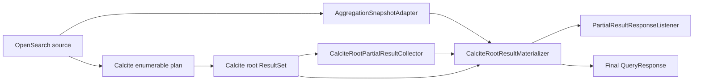

# PPL Partial Results: Option C

## 1. Scope

This change implements the partial-result execution layer for Calcite PPL. It intentionally does
not implement an asynchronous REST API, retained job lifecycle, cancellation, authorization, or
progress tracking. Those capabilities can consume this listener contract without being coupled to
the partial-result producers.

The existing synchronous execution path is unchanged unless its response listener implements
`PartialResultResponseListener`.

## 2. Result contract

`PartialResultResponseListener` adds two callbacks to the existing final-response contract:

```java
void onPartialResultMode(UpdateMode updateMode);

void onPartial(QueryResponse response);
```

The update mode is fixed before the first partial response:

- `APPEND`: each partial response contains only newly finalized rows.
- `REPLACE`: each partial response is the complete current snapshot.

The normal `onResponse` callback remains the authoritative final result.

## 3. Architecture



There is one public listener and one public result format. The two producer locations exist because
a fully pushed single-request aggregation can produce a reduce snapshot before the root
`ResultSet` has a row, while row-producing plans are observed directly at the Calcite root.

## 4. Producer selection

| Physical plan | Producer | Mode | Correctness |
|---|---|---|---|
| Scan plus row-local `Project`, `Filter`, `Calc`, or unordered limit | Calcite root collector | `APPEND` | Rows already emitted by the root cannot change |
| Composite aggregation plus row-local operators | Calcite root collector | `REPLACE` | Completed pages form the current cumulative root snapshot |
| Fully pushed count or non-bucket metric aggregation with the index scan as root | OpenSearch partial-reduce adapter | `REPLACE` | Each reduce output is a provisional complete aggregation snapshot |
| Aggregate, window, join, ordered sort, set operation, or another unsupported blocking plan | None | N/A | Only the final response is published |

Plan classification checks both logical and physical plans before selecting `APPEND`. This prevents
an optimized physical shape from hiding blocking PPL semantics.

## 5. Unified Calcite result materialization

`CalciteRootResultMaterializer` is the only component that creates partial or final public
`QueryResponse` objects.

It combines:

- column names from Calcite JDBC `ResultSetMetaData`;
- column types from the Calcite root `RelDataType`;
- the existing recursive JDBC value conversion for maps, structs, arrays, and geo points;
- runtime type inference for Calcite `ANY` columns.

The final `ResultSet` path and source-native aggregation snapshots therefore use the same column
descriptor, ordering, schema construction, and response construction.

The aggregation adapter does not build a schema:

```java
protected void onPartialReduce(
    List<SearchShard> shards,
    TotalHits totalHits,
    InternalAggregations aggregations,
    int reducePhase) {
  List<ExprValue> sourceRows =
      request.parseAggregationSnapshot(totalHits, aggregations);
  context.publishAggregationSnapshot(sourceRows);
}
```

The execution root owns the conversion to the public result:

```java
rows ->
    listener.onPartial(
        materializer.response(materializer.materializeSourceRows(rows)));
```

If Calcite JDBC metadata is unavailable before execution, the source-native aggregation producer is
not enabled. The query continues through the normal final `ResultSet` path.

## 6. Root collector

`CalciteRootPartialResultCollector` receives rows only after all operators above the source have
processed them.

- For `APPEND`, it publishes the first row immediately and later publishes new row batches.
- For `REPLACE`, it publishes the complete root prefix accumulated at each publication point.
- The final response is still built from all root rows by the same materializer.

This is different from observing `ResultSet.next()` without plan classification: the collector is
enabled only when the plan proves the selected update semantics.

## 7. Source callback propagation

Calcite can prefetch OpenSearch pages on a background executor. `PartialResultContext` is captured
when the scanner is created and restored around each background search. The
`AggregationSnapshotAdapter` also captures the observer directly because OpenSearch reduction
callbacks may execute on a different coordinating thread.

No job state, progress state, or REST-specific object is stored in this context.

## 8. Validation

The focused tests verify:

- JDBC final rows and source aggregation rows produce the same root order and schema;
- source snapshots missing required root columns are rejected;
- `APPEND` publishes only new rows and `REPLACE` publishes a complete snapshot;
- callback context survives background-thread execution;
- stable-row, composite, and non-composite aggregation plans select the expected producer;
- OpenSearch partial-reduce callbacks publish parsed source rows.

Existing Calcite integration tests and YAML REST tests remain the compatibility gates for the
unchanged synchronous path.
