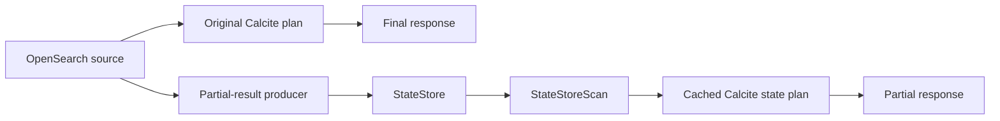
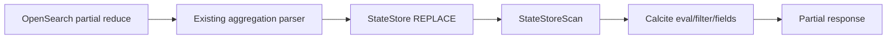
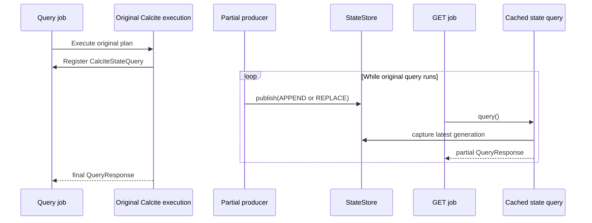

# PPL Partial Results with StateStore

## 1. Scope

This design isolates partial-result production and query execution from the async job API,
lifecycle, and progress tracking. It applies only to the Calcite PPL execution path.

The existing synchronous query remains the source of the final response. Enabling partial results
adds a side path that publishes intermediate state without changing the original plan or final
result.

## 2. Design

### 2.1 Unified model

Every supported query exposes a cached state query:

```text
StateStore + cached Calcite plan = queryable partial result
```

The difference between query types is limited to:

- which component publishes rows to `StateStore`;
- whether a publication appends finalized rows or replaces a mutable snapshot;
- how much of the original Calcite plan remains above `StateStoreScan`.



### 2.2 StateStore

`StateStore` is a thread-safe store of immutable generations. A publisher uses one update mode for
the lifetime of the store:

- `APPEND`: add rows that are final and will not change in later generations;
- `REPLACE`: atomically replace the complete visible snapshot.

Each publication creates a new generation. APPEND generations retain immutable row segments to
avoid copying all previously published rows. REPLACE generations retain only the newest snapshot.

`StateStore` does not parse PPL or SQL and does not execute Calcite. It only owns query state.

```java
StateStore store = new StateStore(UpdateMode.REPLACE);
store.publish(partialRows);
StateStore.Snapshot snapshot = store.snapshot();
```

### 2.3 StateStoreScan

`CalciteEnumerableStateStoreScan` is an Enumerable Calcite leaf. Each new Enumerator captures one
immutable `StateStore.Snapshot`.

An update that arrives during a GET request is therefore not mixed into that response. The next GET
creates a new Enumerator and sees the newest generation.

```java
public Enumerator<Object> enumerator() {
  StateStore.Snapshot snapshot = store.snapshot();
  return new StateStoreEnumerator(snapshot.iterator(), fields);
}
```

### 2.4 Cached state query

`CalciteStateQuery` owns the physical plan after its OpenSearch leaf has been replaced with
`StateStoreScan`.

The same physical `RelNode` cannot be submitted to Calcite's planner repeatedly because Calcite
registers RelNode instances during preparation. The state query therefore compiles the already
optimized Enumerable plan to a `Bindable` on the first GET and caches the executable plan.
Subsequent GET requests bind the same executable plan to a fresh `DataContext`.

This path does not repeat PPL parsing, semantic analysis, pushdown planning, or optimization.

```java
QueryResponse query(CalcitePlanContext context) {
  DataContext dataContext = createDataContext(context, compiledPlan.parameters());
  Enumerable<?> rows = compiledPlan.executable().bind(dataContext);
  return materialize(rows, physicalPlan.getRowType(), context.sysLimit.querySizeLimit());
}
```

The final query continues to use the existing JDBC `ResultSet` path. Final and partial
materialization share the same value conversion and schema inference implementation.

## 3. Producers

### 3.1 Non-blocking query

The original root ResultSet emits finalized rows. `StateStoreRootCollector` publishes the first row
immediately and then publishes bounded row batches using APPEND.

The state query is an identity plan:

```text
StateStoreScan
```

Example:

```text
source=logs
| rex field=body "level=(?<level>error|warn|info)"
| fields `@timestamp`, body, level
| head 250000
```

### 3.2 Composite aggregation

Completed composite pages contain finalized buckets. The root ResultSet publishes those bucket rows
with APPEND. The state query is also an identity `StateStoreScan`.

This does not publish a partially reduced composite page. A page becomes visible only after that
page has completed.

### 3.3 Fully pushed aggregation

OpenSearch's existing `SearchProgressListener.onPartialReduce` callback supplies intermediate
aggregation reductions. `AggregationStateAdapter` parses those reductions with the same
`OpenSearchAggregationResponseParser` used by the normal source response and publishes them with
REPLACE.

The cached state plan preserves row-local Calcite operators above the pushed aggregation and
replaces only the OpenSearch leaf:



Example:

```text
source=logs
| stats count() as total by `resource.attributes.productid`
| eval doubled = total * 2
| fields `resource.attributes.productid`, total, doubled
```

For each partial reduction, `StateStore` contains the current aggregation rows. A GET runs the
cached `eval` and `fields` operators over that snapshot. The client receives a REPLACE response and
must replace its previously displayed result.

## 4. Plan eligibility

`CalciteStateQueryFactory` currently creates a state query for a single OpenSearch leaf with only
row-local operators above it:

- project;
- filter;
- calc;
- system limit;
- unordered sort used as a limit.

The producer is selected from the leaf pushdown specification:

| Physical source | Store mode | State plan |
| --- | --- | --- |
| Hits without pushed aggregation | APPEND | Identity over root rows |
| Composite aggregation | APPEND | Identity over completed buckets |
| Non-composite pushed aggregation | REPLACE | Original row-local suffix with leaf replaced |

A plan with a blocking coordinator operator, multiple sources, join, ordered sort, window, or
timewrap does not expose a running state query in this implementation. Its original final execution
is unchanged.

## 5. Execution lifecycle



The async job layer is responsible for retaining the `CalciteStateQuery`, invoking `query()` for a
poll request, authorizing access, and releasing the job at cancellation or expiration.

## 6. Correctness and isolation

- The final response always comes from the original query execution.
- A partial response reads exactly one immutable StateStore generation.
- APPEND rows are published only after the original root has produced finalized rows.
- REPLACE snapshots represent the latest complete intermediate aggregation reduction available to
  the producer.
- Partial-result publication does not mutate the original Calcite plan.
- A synchronous listener that does not implement `CalciteStateQueryListener` does not create a
  StateStore, install aggregation callbacks, or collect rows.

## 7. Resource behavior

- APPEND storage is segmented and bounded by the query result limit.
- REPLACE discards the previous visible generation when a new snapshot is published.
- Aggregation publication is throttled and uses a smaller existing batched-reduce setting only when
  a state query is active.
- The cached Bindable is compiled once per job and reused by poll requests.
- The job layer must bound retained jobs, result size, and retention time.

## 8. Validation

The implementation tests:

- APPEND and REPLACE generation semantics;
- old-snapshot immutability;
- one-generation-per-Enumerator isolation;
- reuse of one compiled state plan across multiple Store generations;
- Calcite post-processing over REPLACE snapshots;
- immediate first-row publication and subsequent batching;
- publication of an OpenSearch partial reduction into a REPLACE store;
- unchanged existing OpenSearch and Calcite test suites.
