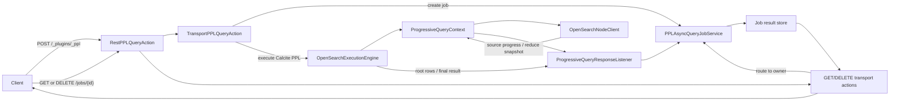
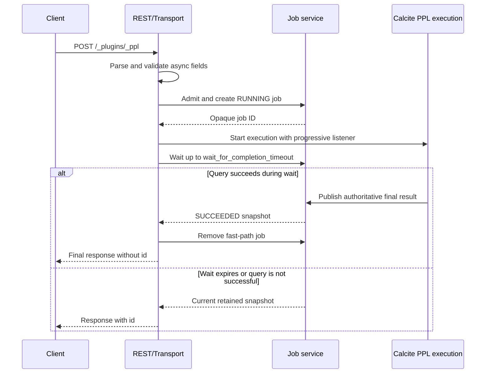
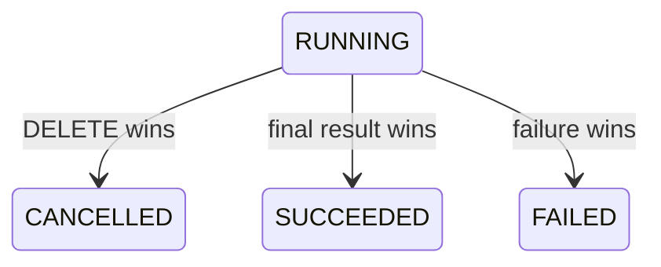
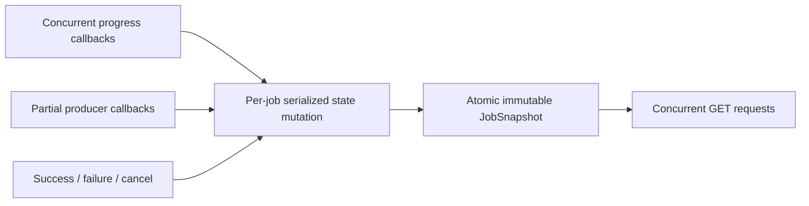
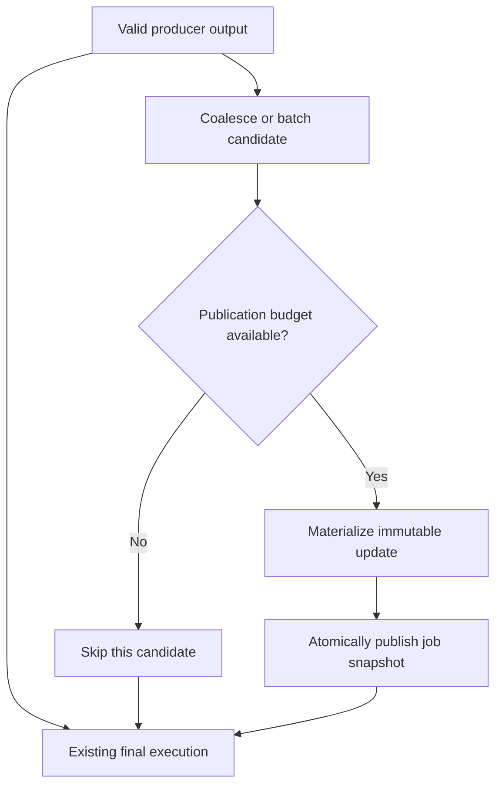
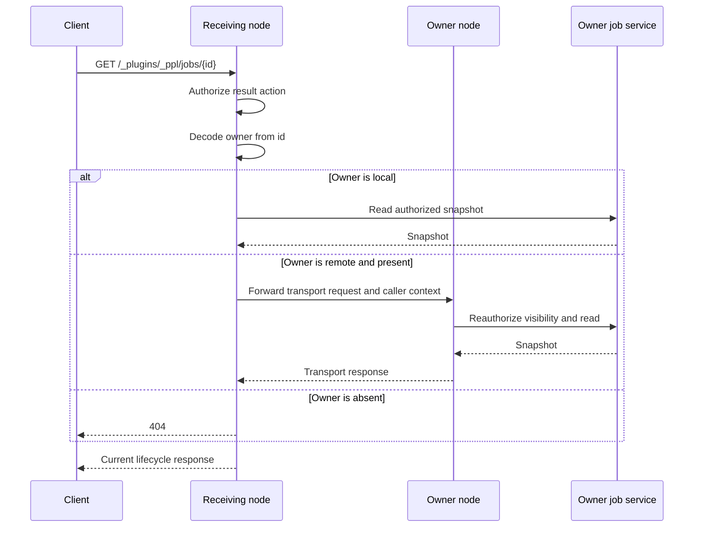

# PPL Progressive Query Execution: Detailed Design

## 1. Scope

This document defines the P0 implementation of PPL Progressive Query Execution for the Calcite
PPL execution path. It follows the
[PPL Progressive Query Execution high-level design](https://chorus.aws.dev/doc/2KCWvGXXa6t7/INTERNAL---PPL-Progressive-Query-Execution).

P0 provides:

- asynchronous submit, poll, and cancel operations through `/_plugins/_ppl`;
- bounded, monotonic progress for every asynchronous Calcite PPL query;
- listener-based partial-result publication when the existing execution path exposes a
  semantically valid intermediate result;
- `APPEND` updates for immutable result prefixes;
- `REPLACE` updates for provisional aggregation snapshots;
- progress-only execution for plans that do not expose valid intermediate rows;
- owner-node job retention and Fine-Grained Access Control (FGAC) for retained state.

The existing synchronous request path remains unchanged. The existing Calcite execution remains
the only producer of the authoritative final result.

## 2. Design principles

### 2.1 Separate query execution from result retrieval

The query runs independently of the submit HTTP connection and of subsequent polling requests.
Polling reads retained job state; it does not drive source pagination, Calcite evaluation, progress
calculation, or partial-result production.

### 2.2 Keep progress and partial results independent

Every supported asynchronous query reports progress. Partial rows are published only when the
execution path has a valid producer. A query can therefore return useful progress without exposing
rows while it is running.

### 2.3 Preserve one authoritative final path

P0 does not replay the query and does not introduce a second final-result computation. Search
responses and Calcite operators continue through the existing execution path. Listener callbacks
observe values already produced by that path.

### 2.4 Prefer conservative partial-result classification

A plan is partial-capable only when both its logical semantics and optimized physical plan prove
that the published rows satisfy the selected update contract. An unrecognized or ambiguous plan is
progress-only.

### 2.5 Keep callbacks off the query critical path

Progress callbacks perform bounded state updates. Partial-result publication uses bounded,
coalesced work and never waits for a client poll. When a publication cannot be admitted within its
resource budget, it is skipped before materialization starts.

## 3. Component design



### 3.1 REST layer

`RestPPLQueryAction` owns the three public routes:

| Operation | Method | Endpoint |
| --- | --- | --- |
| Submit or wait | `POST` | `/_plugins/_ppl` |
| Poll | `GET` | `/_plugins/_ppl/jobs/{id}` |
| Cancel and release | `DELETE` | `/_plugins/_ppl/jobs/{id}` |

The POST request uses the existing synchronous path when neither `wait_for_completion_timeout` nor
`keep_alive` is present. Presence of either field selects the asynchronous path.

GET and DELETE are translated to dedicated transport actions. They may arrive on any node and are
routed to the owner encoded in the job ID.

### 3.2 Job service

`PPLAsyncQueryJobService` owns:

- job admission;
- lifecycle state;
- lease renewal and expiration;
- current progress;
- current partial or final result;
- submit-time completion waiters;
- active source cancellation handles;
- caller visibility checks;
- cleanup after DELETE, expiration, or terminal failure.

The production implementation stores immutable job snapshots behind a mutable, single-writer job
record. REST formatting reads one snapshot and does not hold the job lock while serializing rows.

### 3.3 Execution listener

`ProgressiveQueryResponseListener` extends the existing query response listener with:

```java
void onQueryClassified(UpdateMode mode);
void onProgress(QueryProgress progress);
void onAppend(AppendBatch batch, QueryProgress progress);
void onReplace(QueryResponse snapshot, QueryProgress progress);
void onSearchTaskStarted(long operationId, Runnable cancelAction);
void onSearchTaskFinished(long operationId);
```

The listener is a publication boundary, not a partial-result producer. The caller invokes
`onAppend` or `onReplace` only with a value whose semantics have already been established by plan
classification. The existing `onResponse` callback remains the authoritative final-result
callback.

`AppendBatch` contains the schema, the first row offset, and only the newly finalized rows. This
avoids copying the complete prefix for every publication. The current PoC listener that accepts a
cumulative `QueryResponse` is replaced or adapted to this batch contract before production.

The current PoC's cumulative in-memory result retention is suitable only for semantic validation.
P0 release requires segmented APPEND storage, bounded REPLACE storage, byte admission, and the
security and concurrency validation defined in this document.

### 3.4 Request-scoped execution context

`ProgressiveQueryContext` connects Calcite execution to OpenSearch source operations without
changing the normal OpenSearch request abstraction.

The context contains:

- the job observer;
- a stable ID for every physical source occurrence;
- operation IDs for active OpenSearch search tasks;
- per-source completed units;
- context propagation support for background search threads.

A self-join over one index registers two source occurrences because the query performs two
independent reads.

### 3.5 Progress tracker

`ProgressiveSourceProgress` combines source signals into the public `fraction_done`. It accepts
updates from single-request search, PIT-paged search, aggregation, and Composite aggregation.

### 3.6 Result store

The result store has separate implementations for the two public update modes:

- `AppendResultStore` retains immutable row segments and a monotonically increasing row count.
- `ReplaceResultStore` atomically swaps one complete provisional snapshot.
- after success, `FinalResultStore` exposes the immutable final result through `offset` and
  `count`.

The P0 PoC may use in-memory lists to validate semantics. The production implementation must use
segmented storage and byte accounting so publishing a larger prefix does not repeatedly copy every
previous row.

## 4. API processing

### 4.1 Submit

Async request fields:

| Field | Type | Default on async path | Validation |
| --- | --- | --- | --- |
| `query` | string | none | Valid Calcite PPL |
| `wait_for_completion_timeout` | duration | `5s` | `0s` through `60s` |
| `keep_alive` | duration | `5m` | Greater than `0`, at most `24h` |

If only one async field is present, the other receives its async default.



Processing order:

1. Parse `query`, `wait_for_completion_timeout`, and `keep_alive`.
2. Reject unsupported modes such as explain, analyze, profile, CSV, raw, or visualization output.
3. Apply per-node job admission before starting query execution.
4. Capture the submitter visibility attributes and execution security context.
5. Create the owner-node job.
6. Start the existing Calcite PPL execution with a progressive listener.
7. Register a submit waiter for at most `wait_for_completion_timeout`.
8. Return a final response without an ID only when the query succeeds during the wait.
9. Otherwise return the current retained lifecycle response with the job ID.

The wait timeout does not cancel the query. It only bounds the POST request.

If execution reaches `FAILED` before the wait expires, submit returns the retained failed-job
response with an ID. The caller can inspect or delete that retained lifecycle state.

The job has an internal delivery state:

```text
WAITING_SUBMIT -> FAST_PATH_CLOSED
WAITING_SUBMIT -> RETAINED
```

Successful completion and submit timeout race under the job's single writer. If success wins, the
final response is delivered directly and the transient job is removed without retained-result
admission. If timeout wins, the job enters `RETAINED`, starts its keep-alive lease, and returns the
ID. A terminal failure while waiting also enters `RETAINED`, starts the lease, and returns the
failed response with an ID. A later success after timeout must reserve retained final-result
capacity.

Partial candidates produced during `WAITING_SUBMIT` use the same partial-publication budgets and
stores as retained jobs but are not yet externally addressable. If timeout wins, the current store
becomes visible without copying or changing update semantics. If fast success wins, the transient
partial store is released after the final response is handed to the submit request.

The keep-alive clock does not run while the POST request is still waiting, so a `keep_alive`
shorter than `wait_for_completion_timeout` is valid.

### 4.2 Poll

Poll parameters:

| Parameter | Default | Validation and behavior |
| --- | --- | --- |
| `keep_alive` | Current lease interval | Greater than `0`, at most `24h`; changes and renews the lease |
| `offset` | `0` | Non-negative; must be `0` for running `REPLACE` |
| `count` | `1000` | From `1` through the configured maximum, initially `10000` |

GET processing is:

1. Parse and validate the opaque ID.
2. Route to the owner node if necessary.
3. Authorize the transport action and retained-job visibility.
4. Reject an unknown, expired, deleted, or owner-node-lost job with `404`.
5. Apply an optional `keep_alive` change and renew the lease.
6. Capture one immutable job snapshot.
7. Apply result paging when the current state permits it.
8. Return immediately.

There is no server-side long polling. Each GET returns the current state at the time the owner
captures its snapshot.

### 4.3 Cancel and release

DELETE performs one atomic terminal transition:



If DELETE wins, the job:

1. cancels the parent PPL task;
2. invokes all registered OpenSearch search cancellation handles;
3. stops accepting progress and partial publications;
4. releases result and spill state;
5. returns `CANCELLED`;
6. removes the job so a later GET returns `404`.

If the job is already terminal, DELETE returns the existing terminal status and releases the
retained state.

### 4.4 Response model

Lifecycle responses use the following fields:

| Field | Presence |
| --- | --- |
| `id` | Every retained-job response; omitted from successful submit fast path |
| `status` | Always |
| `start_time_in_millis` | Submit, poll, and successful fast path |
| `expiration_time_in_millis` | Retained-job submit and poll responses |
| `took` | Terminal responses and successful fast path |
| `progress.fraction_done` | Always |
| `update_mode` | After plan classification |
| `schema` | Empty until known; otherwise current or final schema |
| `datarows` | Current requested rows |
| `size` | Number of rows in `datarows` |
| `total` | Rows represented by the current retained result |
| `window` | GET responses when result paging applies |
| `error` | `FAILED` responses |

For running `APPEND`, `total` is the immutable prefix length and `window` describes the returned
slice. For running `REPLACE`, the response contains the complete admitted snapshot, `offset` must
be zero, and no result window is applied. After success, the authoritative final result is pageable
for both modes.

### 4.5 HTTP errors

| HTTP status | Condition |
| ---: | --- |
| `400` | Invalid async field, duration, paging parameter, format, query mode, or malformed job ID |
| `403` | Missing transport permission or retained-job visibility |
| `404` | Unknown, expired, deleted, or owner-node-lost job |
| `429` | Async job or resource admission limit |
| `500` | Submission, routing, or execution setup failure before job creation |

## 5. Job model

### 5.1 Job identity and ownership

The opaque ID encodes:

```text
format_version
owner_node_id
random_context_id
```

The binary representation is URL-safe Base64 encoded. Parsing validates version, component
lengths, and trailing bytes before using the owner information.

The job ID is a routing token, not an authorization credential.

### 5.2 State

Each job retains:

| Field | Purpose |
| --- | --- |
| `id` | Public opaque identifier |
| `status` | `RUNNING`, `SUCCEEDED`, `FAILED`, or `CANCELLED` |
| `start_time` | Query start time |
| `expiration_time` | Current lease expiration |
| `update_mode` | Fixed `APPEND` or `REPLACE` after classification |
| `progress` | Last published monotonic progress |
| `result_ref` | Current partial or final immutable result |
| `failure` | Terminal error when status is `FAILED` |
| `submitter_backend_roles` | Visibility attributes captured at submit |
| `parent_task` | PPL task used for cancellation |
| `search_cancellations` | Active OpenSearch operation cancellation handles |
| `waiters` | Submit requests waiting for completion or timeout |
| `delivery_state` | `WAITING_SUBMIT`, `RETAINED`, or closed fast path |

### 5.3 Lifecycle invariants

- Only `RUNNING` can transition to a terminal state.
- Exactly one of success, failure, or cancellation wins.
- Running progress is finite, monotonic, and no greater than `0.8`.
- `SUCCEEDED` publishes progress `1.0`.
- `FAILED` and `CANCELLED` retain the last running progress.
- The update mode is assigned once and cannot change.
- A partial publication cannot replace a terminal result.
- The final result is immutable.
- Lease renewal changes expiration metadata but not result semantics.

### 5.4 Concurrency

All mutations for one job are serialized by a per-job lock or equivalent single-writer executor.
The mutable record publishes immutable `JobSnapshot` instances for readers.



The terminal transition and final-result reference are published in the same state mutation.
Consequently, a GET cannot observe `SUCCEEDED` with a provisional result.

APPEND materialization is also serialized: at most one APPEND batch is in flight per job, and the
next batch is not materialized until the previous batch commits or fails. REPLACE materialization
may be coalesced, with the internal publication ordinal preventing stale completion from replacing
newer state.

## 6. Calcite execution integration

### 6.1 Execution setup

The progressive context is opened before optimization and execution. A physical-plan hook:

1. enumerates every `CalciteEnumerableIndexScan`;
2. assigns each source occurrence a stable `source_id`;
3. resolves a low-cost source-size estimate;
4. records the source ID on the scan;
5. creates the query-level source progress tracker.

When Calcite creates an enumerator for a scan, the scan restores the source ID into
`ProgressiveQueryContext`. Background page fetching explicitly captures and restores the same
context because executor thread pools do not inherit thread-local state.

Every context installation is scoped. It restores the previous value in `finally`, including
planning hooks, enumerator creation, background page fetches, and source callbacks. A pooled thread
must never retain a job context after the scoped operation completes.

### 6.2 Plan classification

Classification uses both the logical plan and optimized physical plan.

```text
PartialCapability {
  public_update_mode: APPEND | REPLACE
  producer: ROOT_PREFIX | AGGREGATION_REDUCE | COMPOSITE_ROWS | NONE
}
```

The classifier is allow-list based. New Calcite operator families are progress-only until their
partial semantics are explicitly reviewed and tested.

| Plan shape | Producer | Update mode | Running rows |
| --- | --- | --- | --- |
| Single source plus row-local unary operators | Root result batches | `APPEND` | Yes |
| Fully pushed non-bucket aggregation | OpenSearch partial reduce | `REPLACE` | Yes |
| Composite aggregation plus row-local unary operators | Completed Composite response rows | `REPLACE` | Yes |
| Blocking or unsupported plan | None | `REPLACE` | No |

The `REPLACE` mode for a progress-only plan establishes how the eventual result is represented,
but its running responses contain no rows.

### 6.3 Row-local operators

P0 treats the following physical operators as row-local when they have one input and cannot revise
an already emitted root row:

- projection and `fields`;
- `eval` and other project expressions;
- `rex`;
- filter and `where`;
- system limit;
- unordered `head`, limit, and offset.

P0 does not treat the following as stable-prefix operators:

- aggregate;
- ordered sort or TopK;
- window and `eventstats`;
- join;
- set operations;
- response transforms such as `timewrap` that revise the complete output shape;
- any unknown physical operator.

Logical blocking semantics take precedence over a physically simple root. For example, a logical
PPL aggregation cannot be classified as `APPEND` merely because optimization replaces the Calcite
aggregate with one OpenSearch scan.

## 7. Partial-result producers

### 7.1 Stable-prefix root rows

Example:

```text
source=logs-00001
| rex field=body "level[^a-z]+(?<loglevel>error|warn|info)"
| fields `@timestamp`, severityText, body, loglevel
| head 250000
```

Calcite evaluates this plan lazily. Each successful `ResultSet.next()` means the root has produced
one finalized row. Because classification proves that no later input can revise or reorder that
row, accumulated root rows form an immutable prefix.

The root collector publishes when either threshold is reached:

- the number of newly produced rows reaches the next batch target; or
- rows have been produced since the previous publication and the publication interval expires.

The batch target grows geometrically to avoid excessive callback and segment overhead. The
production publisher sends only newly produced immutable rows:

```text
AppendBatch {
  first_row_offset
  rows[]
  schema
}
```

The public `total` is the number of rows retained so far. A client can request rows it has not yet
consumed by setting `offset` to its local row count.

### 7.2 Fully pushed aggregation

Example:

```text
source=logs-00001
| stats sum(`attributes.obs_body_length`) as total_body_bytes,
        avg(severityNumber) as avg_severity,
        max(flags) as max_flags,
        min(severityNumber) as min_severity
```

The optimized physical plan is one OpenSearch scan with a non-Composite aggregation. OpenSearch
performs shard-local aggregation and coordinator reduce. `SearchProgressListener.onPartialReduce`
exposes an `InternalAggregations` value that already represents every shard incorporated into that
reduce.

The producer:

1. verifies that the request parser can convert the reduce value into the physical PPL row type;
2. converts the reduce value to `ExprValue` rows;
3. orders columns according to the physical row type;
4. combines the rows with the corresponding source progress;
5. publishes one complete `REPLACE` snapshot.

Every producer update receives an internal publication ordinal when it is accepted by the
per-job publisher. A completed materialization is retained only if its ordinal is newer than the
currently retained REPLACE ordinal. This prevents an older reduce snapshot from completing late
and replacing a newer snapshot. The ordinal is internal state and is not part of the REST API.

P0 supports reduce snapshots only when the response parser is snapshot-safe. The initial
implementation includes non-bucket metric aggregation and `count()` represented by total hits.
Grouped aggregation is handled through the Composite path.

Reduce snapshots are throttled. The search request may lower `batched_reduce_size` only within a
configured and benchmarked bound; it must not force a reduce frequency that materially degrades
the equivalent synchronous query.

### 7.3 Composite aggregation

Example:

```text
source=logs-00001
| stats count() as total by `resource.attributes.productid`
| eval doubled = total * 2
| fields `resource.attributes.productid`, total, doubled
```

OpenSearch returns finalized buckets for one Composite page and an `after_key` for the next page.
The existing scanner advances the request with that key. Rows from a completed response flow
through the allowed row-local Calcite operators.

Every published snapshot contains all root rows produced from completed responses so far. The
public mode is `REPLACE`, not `APPEND`, because the API does not expose Composite page identity and
the provisional result is represented as one self-contained view.

The producer is enabled only when every coordinator operator above the Composite scan is
row-local. A plan such as Composite aggregate followed by ordered sort remains progress-only.

### 7.4 Progress-only plans

Example:

```text
source=logs-00001
| eventstats count() as product_log_count by `resource.attributes.productid`
| fields `@timestamp`, `resource.attributes.productid`, product_log_count
```

`eventstats` can revise rows after additional input changes partition state. The existing operator
does not expose a valid root snapshot while running. P0 therefore publishes:

- status and progress while the query is running;
- no running rows;
- the authoritative result after the existing Calcite execution completes.

The same rule applies to ordered sort, window, blocking joins, and unrecognized operator
combinations.

## 8. Progress tracking

### 8.1 Public calculation

Each physical source reports a source fraction in `[0.0, 1.0]`. The query combines them as defined
by the high-level design:

```text
if every source has an estimated document count:
    combined =
        sum(source_estimated_docs[i] * source_fraction[i])
        / sum(source_estimated_docs[i])
else:
    combined = average(source_fraction[i])

candidate = 0.80 * combined
published = max(previous_published, min(candidate, 0.80))
```

If all known source estimates are zero, sources use equal weight.

The 20% reserve does not estimate coordinator progress. It prevents source completion from
reporting query completion while blocking coordinator work may remain. A running query can remain
at `0.8`; the terminal status determines completion.

A source-less Calcite plan reports `0.0` while running and `1.0` only after successful completion.

### 8.2 Source estimate

Before source execution, the owner requests the docs metric for the source's resolved concrete
indices. The estimate is the sum of live primary-shard `docs.count`.

The same response retains the individual primary-shard counts used by single-request shard
weighting. Repeated physical sources over the same concrete indices may share the immutable stats
result while keeping independent source progress state.

The estimate is unavailable if:

- the stats request is unauthorized;
- the request times out or fails;
- any participating primary shard fails;
- a participating primary shard does not provide a valid document count.

Partial stats are discarded. Failure to obtain an estimate does not fail query execution.

This request estimates index size, not filter selectivity. It does not enable exact total-hit
tracking. It uses a bounded timeout; timeout or permission failure immediately selects the
documented fallback so source estimation cannot delay execution indefinitely.

### 8.3 Single-request hit search

`onListShards` registers participating and skipped shards. `onQueryResult` or `onQueryFailure`
marks source collection complete for a shard. Skipped shards contribute no work, and the final
response closes any callback gap.

Fetch callbacks are not used as the source-completion signal. They describe retrieval of selected
hits after query collection and are not emitted for every shard that performed source work.

When per-shard primary document counts are available:

```text
source_fraction =
    completed_primary_docs_weight / participating_primary_docs_weight
```

Otherwise each participating shard has equal weight.

### 8.4 Single-request aggregation

Aggregation progress uses query and reduce callbacks:

- query-result callbacks indicate shard-local aggregation completion;
- partial and final reduce callbacks identify shards incorporated into reduce state;
- shard identities are deduplicated;
- final response completion closes any callback gap.

The fraction is weighted by primary-shard document counts when available and by equal shard weight
otherwise.

This value estimates source work incorporated into aggregation processing. It does not claim that
the final aggregation value is proportionally complete.

### 8.5 PIT-paged hit search

For a paged hit source:

```text
estimated_pages = max(ceil(estimated_source_docs / search_page_size), 1)
source_fraction = min(completed_pages / estimated_pages, 1.0)
```

`search_page_size` is the `size` on the physical OpenSearch `SearchRequest`, not the async GET
`count`.

Within an in-flight page, query/fetch shard callbacks contribute a bounded fraction of one expected
page. After the response arrives, the actual returned hit count replaces that in-flight estimate.

If the index-size estimate is unavailable, a `TotalHits` value naturally present in the response
is used without forcing exact tracking. If neither is available:

```text
adaptive_total_rows = max(returned_rows + search_page_size, search_page_size)
source_fraction = returned_rows / adaptive_total_rows
```

End of stream, an intentional upstream limit, or source close marks the source complete.

### 8.6 Composite aggregation

Each Composite response provides bucket `doc_count` values. Completed source coverage is:

```text
observed_coverage += sum(bucket.doc_count in completed_response)
source_fraction = min(observed_coverage / estimated_source_docs, 1.0)
```

If the index-size estimate is unavailable:

```text
next_page_coverage = max(latest_nonempty_page_coverage, 1)
adaptive_total_coverage = observed_coverage + next_page_coverage
source_fraction = observed_coverage / adaptive_total_coverage
```

Multi-valued group keys can count one document in multiple buckets, missing keys can omit
documents, and filtering can make the index-size denominator conservative. Monotonic publication,
the source clamp, and the public `0.8` cap prevent those estimation errors from exceeding the
public range. End of stream completes the source.

### 8.7 Multiple sources

All physical source occurrences are registered before the tracker publishes progress. This avoids
starting with a denominator containing only the first source and then moving backward when a later
source appears.

For a join with source estimates of nine million and one million documents, where the first source
is 50% complete and the second is complete:

```text
combined = (9,000,000 * 0.50 + 1,000,000 * 1.00) / 10,000,000
         = 0.55

public = 0.80 * 0.55
       = 0.44
```

The join may still be progress-only for partial rows.

## 9. Publication and result storage

### 9.1 Execution-driven publication



Polling is absent from this flow. A client that never polls does not prevent execution from
finishing.

### 9.2 APPEND storage

`AppendResultStore` uses immutable row segments:

```text
AppendResultStore {
  schema
  segments[]
  total_rows
  retained_bytes
}
```

Publishing appends one new segment. Existing segments are never copied, revised, or removed while
the job is running.

A GET with `offset` and `count` locates the intersecting segments and serializes only the requested
rows. The job snapshot fixes `total_rows` and the segment list for that response.

An APPEND publication is accepted only when `first_row_offset` equals the store's current
`total_rows`. The single in-flight rule preserves that order. A duplicate or stale batch is
discarded; a gap after ordered materialization is an internal execution error and fails the job.

### 9.3 REPLACE storage

`ReplaceResultStore` retains one immutable snapshot:

```text
ReplaceResultStore {
  schema
  rows
  retained_bytes
}
```

A newer admitted publication atomically replaces the previous reference. A GET captures either the
old complete snapshot or the new complete snapshot, never a partially written combination.

Running REPLACE results are not paged. If a complete snapshot exceeds the configured partial rows
or byte limit, that candidate is skipped before materialization and the query continues with
progress.

### 9.4 Final storage

Success atomically replaces the running result reference with the authoritative final store.
Final results can be paged with `offset` and `count` regardless of the running update mode.

Final storage is constructed from the response delivered by the existing final execution callback.
An implementation may deduplicate immutable row objects or segments after validating them against
that response, but the final callback controls the schema, complete row count, values, and ordering.

A retained job reserves final retention capacity before publishing `SUCCEEDED`. If the result
cannot be retained in memory or approved spill capacity, the job transitions to `FAILED` with an
explicit resource-limit error instead of publishing success with an unavailable result. A
successful completion that wins while the submit request is still waiting is returned directly and
does not require retained-result capacity.

### 9.5 Publication errors

Resource admission is checked before publication work starts. A candidate that cannot be admitted
is skipped.

After work is admitted, conversion, materialization, or storage failure fails the job. The error is
not silently ignored because the job has already committed resources and entered partial-result
processing for that candidate.

When publication failure wins the terminal transition, the job stops accepting callbacks, cancels
the parent Calcite task and active OpenSearch source tasks, and releases execution-only resources.

## 10. Security

### 10.1 Action permissions

| Operation | Permission |
| --- | --- |
| Submit | `cluster:admin/opensearch/ppl` |
| Get | `cluster:admin/opensearch/ppl/async_query/result` |
| Delete | `cluster:admin/opensearch/ppl/async_query/delete` |

The existing submit permission remains unchanged. GET and DELETE operate on retained data and use
separate transport permissions.

### 10.2 Execution context

At submission, the asynchronous execution captures the OpenSearch security context needed to run
the equivalent synchronous PPL query. Planning, index metadata access, source-size estimation, and
OpenSearch search requests restore that context through OpenSearch thread-context propagation.

The submit HTTP channel can close after the job starts without clearing the execution context.
The restorable execution context exists only while the query is running and is cleared on success,
failure, or cancellation. A terminal job retains only result state and immutable visibility
attributes such as the submitter backend roles.

### 10.3 Retained-job visibility

The job stores the submitter's backend-role set. GET and DELETE require:

```text
submitter_backend_roles is a subset of caller_backend_roles
```

The caller's current roles are evaluated on every operation. The receiving node authorizes the
transport action before routing, and the owner node authorizes job visibility before returning
metadata, rows, or errors.

Unauthorized access returns `403` without exposing job metadata.

If the submitter has no backend roles, the subset condition is satisfied by any caller that has the
GET or DELETE action permission. Administrators must therefore grant those action permissions
carefully.

### 10.4 Data handling

- Query text, rows, schema, job IDs, and detailed errors are not emitted to ordinary metrics.
- Logs use opaque request correlation and sanitized failure categories.
- In-memory and spill data are reachable only through authorized async transport actions.
- Temporary execution spill is released when execution terminates.
- Spill backing a retained successful result remains until DELETE or expiration.
- Failure and cancellation clear preview rows and remove their result spill.
- Best-effort startup cleanup removes orphaned job spill after an unclean node shutdown.

## 11. Routing and node failure



P0 does not replicate job state. Owner-node departure loses the execution and retained result.
Because the context is no longer addressable, GET and DELETE return `404`.

## 12. Cancellation, failure, and expiration

### 12.1 Cancellation propagation

The job registers:

- the parent PPL `CancellableTask`;
- every monitored OpenSearch `SearchTask`;
- background page futures;
- result materialization work;
- spill resources.

Cancellation is idempotent. A search operation unregisters its cancellation handle when it
finishes.

### 12.2 Execution failure

Failure after job creation transitions the job to `FAILED`. GET returns HTTP `200` with lifecycle
status and an error object. The terminal failure clears partial rows and reports `size: 0` and
`total: 0`; only lifecycle metadata and the error remain until DELETE or expiration.

Failure before job creation follows the normal REST error path.

### 12.3 Expiration

Each authorized GET renews expiration using the current lease interval. An optional GET
`keep_alive` changes that interval before renewal.

The owner performs expiration:

- lazily on job access;
- during job admission;
- through a periodic reaper.

Expiration cancels a running job, wakes submit waiters with not-found, and releases all retained
resources.

## 13. Resource management

### 13.1 Admission

The owner checks admission before starting execution:

| Resource | Behavior |
| --- | --- |
| Concurrent running jobs | Reject submit with `429` at the configured owner-node limit |
| Retained jobs | Reject submit with `429` at the configured owner-node limit |
| Retained bytes | Reject submit with `429`; do not evict a retained job before its lease expires |
| Result page size | Reject an invalid GET with `400` |
| Keep-alive | Reject an invalid duration with `400` |

The default running-job limit is `2 * allocated_processors`; the default retained-job limit is
`10000`.

Proposed node settings:

| Setting | Purpose | Initial default |
| --- | --- | --- |
| `plugins.ppl.async.max_running_jobs` | Concurrent RUNNING jobs | `2 * allocated_processors` |
| `plugins.ppl.async.max_retained_jobs` | All retained jobs | `10000` |
| `plugins.ppl.async.max_page_size` | Maximum GET `count` | `10000` |
| `plugins.ppl.async.max_partial_rows` | Maximum rows in one running REPLACE snapshot | Benchmark-derived |
| `plugins.ppl.async.max_partial_bytes` | Maximum bytes in one partial publication | Benchmark-derived |
| `plugins.ppl.async.max_retained_bytes` | Aggregate retained bytes per owner node | Benchmark-derived |
| `plugins.ppl.async.publication_interval` | Minimum time between ordinary publications | Benchmark-derived |

The benchmark-derived defaults are finalized before release and remain dynamically configurable.

### 13.2 Publication budget

Each job and owner node account for:

- APPEND segment rows and bytes;
- REPLACE snapshot rows and bytes;
- final result rows and bytes;
- in-flight materialization bytes;
- spill bytes;
- publication CPU concurrency.

The publisher reserves capacity before conversion or copying. REPLACE candidates can be coalesced
so only the newest pending candidate is materialized. APPEND batches are not dropped after rows
have been promised through a published `total`; admission therefore occurs before adding a segment.

Final-result retention is mandatory. The job attempts its configured in-memory and spill tiers
before failing with a resource-limit error.

### 13.3 Backpressure

Partial publication must not stop source consumption indefinitely.

- Progress updates are coalesced to the latest value.
- REPLACE candidates are coalesced to the newest complete candidate.
- APPEND uses bounded batches and segmented storage.
- If APPEND retention reaches its hard limit, the job fails explicitly rather than changing
  immutable-prefix semantics.
- If a REPLACE candidate exceeds its publication limit, that candidate is skipped before
  processing and progress continues.

### 13.4 Cleanup

All resource holders implement idempotent close. Cleanup order is:

1. stop accepting callbacks;
2. cancel active work when needed;
3. release materialization reservations;
4. close result stores;
5. remove spill files;
6. remove the job from the owner map.

## 14. Compatibility

### 14.1 Synchronous requests

Requests without asynchronous fields:

- use `RestCancellableNodeClient`;
- retain existing disconnect cancellation;
- do not create a job;
- do not allocate progressive storage;
- do not install the progressive listener;
- preserve the existing response format and error behavior.

### 14.2 Query semantics

The final asynchronous response comes from the same Calcite PPL execution and formatter as the
equivalent synchronous query. The feature does not change expression evaluation, null handling,
aggregation functions, ordering, limits, or cursor semantics.

### 14.3 Response formats

P0 supports the JSON-compatible PPL response used by the job API. Explain, analyze, profile, CSV,
raw, and visualization responses remain synchronous or are rejected when asynchronous fields are
present.

## 15. Observability

Metrics use aggregate counts and sizes without query text or row values:

- submitted, running, succeeded, failed, cancelled, and expired jobs;
- admission rejections by reason;
- owner-node routing count and failure count;
- time to first progress;
- time to first partial rows;
- final latency;
- progress callback count and coalescing count;
- APPEND rows and bytes retained;
- REPLACE publications attempted, published, skipped, and coalesced;
- final retained bytes;
- cancellation propagation latency;
- cleanup failures.

Debug logging may include job-state transitions using a hashed context ID. It must not include the
public job ID, query text, schema, rows, backend roles, or serialized security context.

## 16. Validation

### 16.1 API matrix

REST tests cover:

- synchronous compatibility;
- fast successful completion without an ID;
- zero-wait submission with an ID;
- GET lease renewal;
- APPEND paging;
- running REPLACE no-paging validation;
- final paging;
- cancel and subsequent `404`;
- expiration;
- owner-node routing and owner-node loss;
- all lifecycle statuses and HTTP errors.

### 16.2 Progress matrix

For every source shape, tests assert:

- every value is finite;
- running values are in `[0.0, 0.8]`;
- values never decrease;
- success is exactly `1.0`;
- failure and cancellation preserve the latest running value;
- multiple sources are registered before the first non-zero publication;
- missing stats use the documented fallback;
- estimates never produce a public value greater than `1.0`.

The source matrix includes:

- single-request hit search with and without a fetch phase;
- single-request aggregation;
- PIT-paged hit search;
- Composite aggregation;
- filtered and unfiltered sources;
- wildcard and alias resolution;
- self-join and multiple distinct sources;
- empty indices and unavailable source estimates.

### 16.3 Partial-result matrix

| Query pattern | Required assertion |
| --- | --- |
| REX/eval/fields/head | Every APPEND row is the same row at the same position in final |
| Fully pushed metric aggregation | Each running response is a complete REPLACE snapshot |
| Composite aggregation | Snapshot contains only completed-response rows after row-local processing |
| Composite plus blocking sort | Running responses contain no rows |
| Eventstats/window | Running responses contain no rows |
| Join and set operations | Running responses contain no rows in P0 |

Every final result is compared with the synchronous result for schema, row values, row count, and
defined ordering.

### 16.4 Concurrency and failure injection

Tests cover:

- progress racing with partial publication;
- completion racing with cancel;
- failure racing with cancel;
- expiration racing with GET renewal;
- DELETE racing with routed GET;
- late callbacks after terminal state;
- duplicate shard callbacks;
- source task cancellation registration and removal;
- result-store allocation failure;
- spill cleanup failure;
- owner departure during GET routing.

### 16.5 Performance

Benchmarks compare synchronous and asynchronous execution under the same dataset, query, cluster,
and concurrency:

- final latency;
- source throughput;
- coordinator CPU;
- heap and retained bytes;
- network bytes;
- aggregation reduce cost;
- cancellation latency.

The matrix includes stable-prefix scans, fully pushed aggregation, multi-page Composite
aggregation, and progress-only blocking plans. Publication frequency and reduce throttling are
tuned from these results rather than from client polling frequency.

## 17. Implementation sequence

### 17.1 API and lifecycle

1. Register GET and DELETE transport actions.
2. Add async-field parsing without changing the synchronous branch.
3. Implement owner-routable job IDs.
4. Implement the job state machine, lease, cancel, expiration, and response formatter.
5. Add FGAC action permissions and retained-job visibility checks.

### 17.2 Progress

1. Register all physical sources before execution.
2. Capture source context across background page fetches.
3. Add search progress listeners and cancellation handles.
4. Add source-size estimation and the four source estimators.
5. Combine and cap query progress at `0.8` while running.

### 17.3 P0 partial results

1. Add conservative logical and physical plan classification.
2. Publish stable root prefixes through `APPEND`.
3. Publish supported aggregation partial-reduce values through `REPLACE`.
4. Publish completed Composite result rows through `REPLACE`.
5. Keep blocking and unsupported plans progress-only.

### 17.4 Production hardening

1. Replace full-list PoC retention with segmented APPEND and atomic REPLACE stores.
2. Add byte-based admission, publication coalescing, and spill lifecycle.
3. Add multi-node security and lifecycle race tests.
4. Benchmark reduce frequency, publication thresholds, and async overhead.
5. Run the full Calcite integration and YAML REST suites before release.
