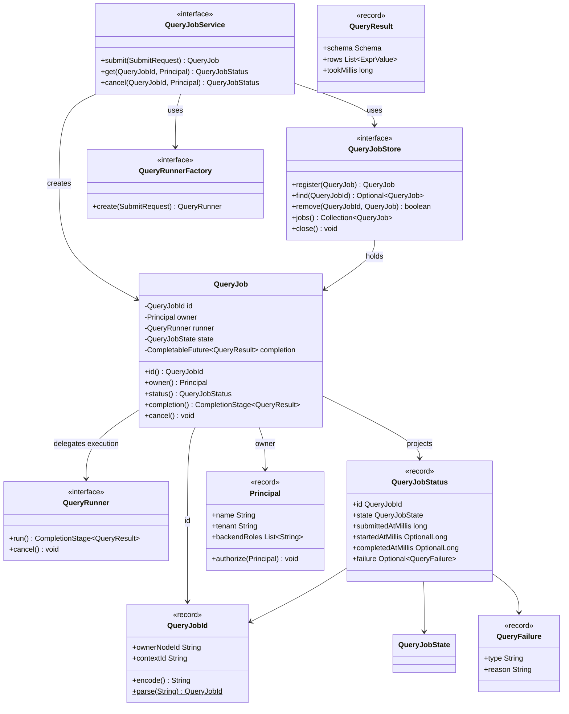
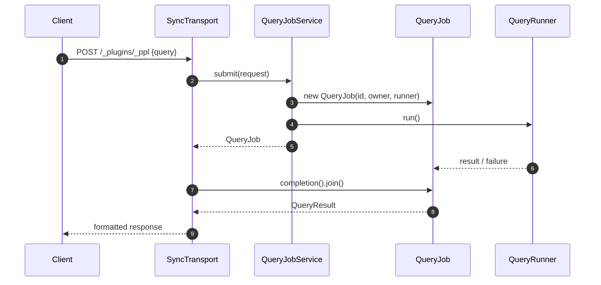
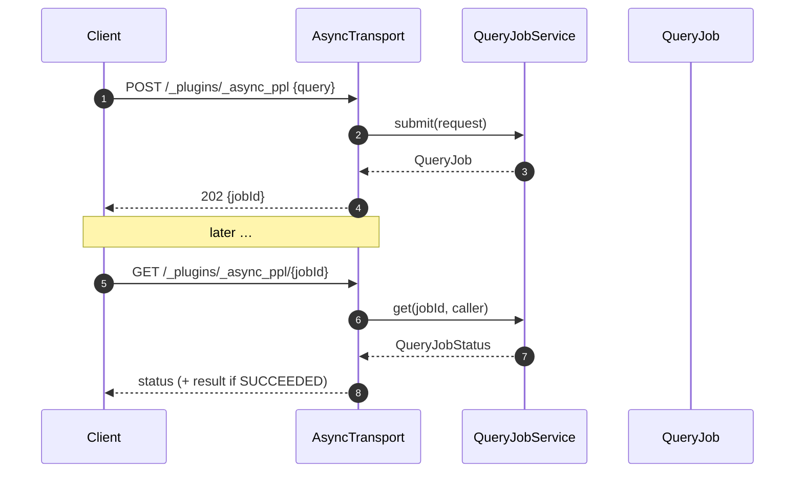

# Query Job Lifecycle — MVP Redesign

> Response to review of [PR #5809](https://github.com/opensearch-project/sql/pull/5809).
> This document is design-only; no code has been changed.

## 1. What we heard from review

Three concerns from @dai-chen shaped this redesign.

| # | Concern | Where it landed |
|---|---------|-----------------|
| 1 | Make the lifecycle layer language-neutral, similar to Livy's control plane over Spark. | The `job` package no longer names PPL. It talks only to a `QueryRunner` SPI. Language modules (`ppl`, `sql`, `async-query`) implement `QueryRunnerFactory`. |
| 2 | The execution boundary can be engine-neutral too — SQL, PPL, and AE all run behind it. | `QueryRunner` returns a neutral `QueryResult`. It knows nothing about ANTLR, `PPLService`, `SQLService`, or Spark. The same interface fits AE. |
| 3 | Separate execution state from retention. In a BigQuery-style model the job stays `RUNNING` regardless of whether a caller is still waiting. Treat `wait_for_completion_timeout` as submit-response behavior only. | The state machine has five values (`PENDING`, `RUNNING`, `SUCCEEDED`, `FAILED`, `CANCELLED`) and no retention axis. Waiting is a *transport* concern, not a *lifecycle* concern. |
| 3a | Extract internal responsibilities (JobStore, LeaseManager, …) from the service class. | `QueryJobService`, `QueryJobStore`, and `QueryJob` split along Single-Responsibility lines. `LeaseManager` is intentionally out of MVP; it can be added without changing the public interfaces (§7). |

## 2. MVP scope

**In**

- One neutral job model that carries both sync and async queries.
- Submit / get / cancel over a small, engine-agnostic control plane.
- Owner-node routing via an opaque `QueryJobId`.
- Caller identity captured at submit and checked at get / cancel.

**Out (deferred without breaking the API)**

- `wait_for_completion_timeout` — MVP treats every submission as `wait_for_completion=forever`. The transport blocks on `QueryJob#completion()` until it resolves.
- `keep_alive` and retention leases — no expiry timer, no keep-alive renewal. Terminal jobs live only long enough for the caller to observe them.
- Admission control (`maxRunningQueries`, `maxRetainedJobs`).
- Persistent job store.
- Partial-result streaming (already deferred by the current PR).

Everything under **Out** is a store, service, or transport concern. None of it changes the class surface described in §4.

## 3. Livy inspiration in one paragraph

Livy is a REST control plane that owns *sessions* and *statements* on top of Spark. Livy has no compiler and no query engine — it accepts a language tag (`scala`, `python`, `sql`, `r`), forwards the statement to the right session, and tracks a state machine on top. The session state machine is small: waiting → running → available | error | cancelled. Language is data; the control plane is code. We adopt the same split: `QueryJob` is language-blind, and `QueryRunner` is the per-engine adapter.

## 4. Class model

### 4.1 Package layout

```
core/src/main/java/org/opensearch/sql/job/
├── QueryJob.java                 // active object (state machine)
├── QueryJobId.java               // opaque, node-routable identifier
├── QueryJobState.java            // PENDING, RUNNING, SUCCEEDED, FAILED, CANCELLED
├── QueryJobStatus.java           // immutable snapshot
├── QueryJobStore.java            // registry SPI (in-memory MVP impl provided)
├── QueryJobService.java          // control plane: submit / get / cancel
├── QueryRunner.java              // engine SPI: run() + cancel()
├── QueryRunnerFactory.java       // engine SPI: build a runner from a request
├── QueryResult.java              // neutral final result
├── QueryFailure.java             // neutral failure descriptor
├── Principal.java                // caller identity + authorization
└── SubmitRequest.java            // neutral submission payload
```

`core` already has no dependency on other modules, so `job` is free of language and engine imports. `ppl`, `sql`, `async-query`, and future engines depend on `job` — not the other way around.

### 4.2 Class diagram



### 4.3 State machine

Retention is not part of state. Waiting is not part of state.

```
              submit()
               │
               ▼
           ┌───────┐  runner starts   ┌────────┐
           │PENDING│─────────────────▶│RUNNING │
           └───────┘                   └────┬───┘
                                            │
                    ┌───────────────────────┼───────────────────────┐
                    ▼                       ▼                       ▼
               ┌─────────┐             ┌────────┐             ┌─────────┐
               │SUCCEEDED│             │ FAILED │             │CANCELLED│
               └─────────┘             └────────┘             └─────────┘

Terminal transitions are idempotent. cancel() from any non-terminal state
moves to CANCELLED; cancel() from a terminal state is a no-op.
```

## 5. Interface contracts

Signatures below define the contract only. JavaDoc phrased for readers of Effective Java: each interface has one reason to exist (Item 20) and each record documents its invariants (Item 17).

### 5.1 `QueryJobId`

```java
public record QueryJobId(String ownerNodeId, String contextId) {
    public QueryJobId {
        // both fields must be non-blank
    }
    /** Fresh ID with a random context. */
    public static QueryJobId create(String ownerNodeId) { … }
    /** URL-safe, versioned, opaque encoding. */
    public String encode() { … }
    /** Uniform error on any parse failure. */
    public static QueryJobId parse(String encoded) { … }
}
```

Kept intentionally identical to today's `QueryJobId`. The encoding is a public wire format; a design-level rewrite must not disturb it.

### 5.2 `Principal`

```java
public record Principal(String name, String tenant, List<String> backendRoles) {
    public static final Principal UNSECURED = new Principal(null, null, List.of());
    public static Principal current(ThreadContext ctx) { … }
    public void authorize(Principal caller) { … }
}
```

Renamed from `QueryJobOwner` for neutrality — the identity is not job-specific and will be reused by any future admin action.

### 5.3 `QueryJobState`, `QueryJobStatus`, `QueryFailure`

```java
public enum QueryJobState {
    PENDING, RUNNING, SUCCEEDED, FAILED, CANCELLED;
    public boolean isTerminal() { … }
}

public record QueryJobStatus(
        QueryJobId id,
        QueryJobState state,
        long submittedAtMillis,
        OptionalLong startedAtMillis,
        OptionalLong completedAtMillis,
        Optional<QueryFailure> failure,
        Optional<QueryResult> result) {
    // result present iff state == SUCCEEDED
    // failure present iff state == FAILED
}

public record QueryFailure(String type, String reason) {
    public static QueryFailure of(Throwable t) { … }
}
```

`QueryJobStatus` collapses the previous `Snapshot` sealed hierarchy. The three record variants (`Running`, `Succeeded`, `Failed`) exist today only because retention returned different shapes; without retention, one record with a state discriminator is smaller and enforces the same invariants via record validation.

### 5.4 `QueryResult`

```java
public record QueryResult(Schema schema, List<ExprValue> rows, long tookMillis) {}
```

Uses the existing `core` types (`ExecutionEngine.Schema`, `ExprValue`) so all engines already implementing them can produce a `QueryResult` without introducing new dependencies.

### 5.5 `SubmitRequest`

```java
public record SubmitRequest(
        String language,             // "ppl" | "sql" | ...
        String statement,
        Map<String, Object> params,  // engine-specific, opaque to core
        Principal submitter) {}
```

Language is data. The service uses it to pick a `QueryRunnerFactory`. Neither the service nor the job parses `statement` or reads `params`.

### 5.6 `QueryRunner` and `QueryRunnerFactory`

```java
public interface QueryRunner {
    /** Single-use. Multiple invocations must throw IllegalStateException. */
    CompletionStage<QueryResult> run();

    /** Idempotent cooperative cancel. Safe to call before run() and after completion. */
    void cancel();
}

public interface QueryRunnerFactory {
    /** Language handled by this factory, matched against SubmitRequest#language. */
    String language();
    QueryRunner create(SubmitRequest request);
}
```

Two-method interface (Item 21: interfaces are for use, not for reuse). PPL, SQL, and AE each provide one implementation and register it via Guice. The lifecycle package never imports any of them.

### 5.7 `QueryJob`

```java
public final class QueryJob {

    /** Package-private: only QueryJobService instantiates jobs. */
    QueryJob(QueryJobId id, Principal owner, QueryRunner runner, Clock clock) { … }

    public QueryJobId id() { … }
    public Principal owner() { … }
    public QueryJobStatus status() { … }         // snapshot, never throws
    public CompletionStage<QueryResult> completion() { … }
    public void cancel() { … }                   // idempotent
}
```

- Thread safety documented at the class level (Effective Java Item 82). All mutable fields are guarded by `this`; every side effect (runner cancel, store removal, listener notification) happens **after** the monitor is released, exactly as today's `QueryJob` does.
- `completion()` returns a `CompletionStage` view. The internal `CompletableFuture` is never leaked, so callers cannot complete the job externally (Item 15).
- `cancel()` is the *only* public mutator. Retention, expiry, and admission are not job concerns.

### 5.8 `QueryJobStore`

```java
public interface QueryJobStore extends Closeable {
    QueryJob register(QueryJob job);              // returns existing on duplicate ID
    Optional<QueryJob> find(QueryJobId id);
    boolean remove(QueryJobId id, QueryJob job);  // conditional
    Collection<QueryJob> jobs();
    @Override void close();                       // drops residual jobs
}
```

The MVP ships one implementation: `InMemoryQueryJobStore`, a thin wrapper around `ConcurrentHashMap`. A persistent (system-index) implementation can be added later without touching `QueryJob` or `QueryJobService`.

### 5.9 `QueryJobService`

```java
public interface QueryJobService {
    QueryJob submit(SubmitRequest request);
    QueryJobStatus get(QueryJobId id, Principal caller);
    QueryJobStatus cancel(QueryJobId id, Principal caller);
}
```

A single production implementation, `LocalQueryJobService`, wires:

- `QueryJobStore` for the registry,
- a `Map<String, QueryRunnerFactory>` keyed by language,
- a `Clock` supplier,
- a local-node-id supplier for job ID minting.

The service is **not** an `AbstractLifecycleComponent`. Lifecycle wiring (start / stop) lives in the plugin module (`AsyncQueryLifecycle`), keeping `core` free of OpenSearch node types.

## 6. Sync = async with `wait_for_timeout=forever`

Only the transport layer knows whether a caller is willing to wait.



The async transport differs only after step 5:



Both paths use the same `QueryJob`. Nothing about the job knows which one was chosen.

## 7. Extensibility without churn

Every deferred feature lands behind an interface that already exists.

| Feature | Change surface |
|---------|----------------|
| `wait_for_completion_timeout` | Transport chooses `completion().orTimeout(...)` and returns `QueryJobStatus.RUNNING` on timeout. Job unchanged. |
| `keep_alive` | New `RetentionPolicy` composed into `QueryJobService`. Adds an `AutoCloseable` timer per terminal job; store gains `evict()`. Job unchanged. |
| Admission control | `AdmissionController` interface, invoked before `store.register`. Job unchanged. |
| Persistent job metadata | Alternate `QueryJobStore` implementation. Service and job unchanged. |
| SQL and AE support | New `QueryRunnerFactory` implementations. Zero core changes. |
| Progress / partial results | `QueryRunner` gains a second method (default returning empty). All existing engines compile without change. |

Because each seam is an interface with one reason to change, the deferrals really are deferrals — not "we'll rewrite later".

## 8. Effective Java / Clean Code checklist

- **Item 1** — Static factory methods where they help: `QueryJobId.create`, `QueryFailure.of`, `Principal.current`. Constructors are hidden or package-private.
- **Item 15** — `QueryJob`'s `CompletableFuture` is never exposed; only its `CompletionStage` view is.
- **Item 17** — `QueryJobId`, `QueryJobStatus`, `QueryFailure`, `QueryResult`, `Principal`, `SubmitRequest` are `record`s with compact-constructor validation.
- **Item 18** — `QueryJobService` composes a store, factories, and a clock. No inheritance chain.
- **Item 20** — Every seam is an interface. Alternate engines and stores drop in.
- **Item 22** — Each interface expresses one role; no marker or constant interfaces.
- **Item 24** — `QueryJobStatus` is a top-level record, not a nested type of `QueryJob`.
- **Item 55** — `Optional` on values that legitimately may be absent (`find`, `failure`, `result`, `startedAtMillis`). `OptionalLong` for the primitive fields (Item 55 forbids `Optional<Long>`).
- **Item 82** — `QueryJob` documents thread-safety at class level and lists guarded fields.
- **Clean Code, small classes** — the biggest class in the package is `QueryJob`; its public API is four methods.
- **Clean Code, intent-revealing names** — `submit` / `get` / `cancel`, `register` / `find` / `remove`. No `handleXxx`, no `processYyy`.
- **Clean Code, no duplication** — sync and async share one `QueryJob`; only the transport layer differs.

## 9. What migrates from the current PR

The existing branch already ships the plumbing this design keeps. The redesign is refactor-shaped, not rewrite-shaped:

| Today (`feat/query-job-refactor`) | MVP redesign |
|-----------------------------------|--------------|
| `plugin.transport.asyncquery.QueryJob` (983 lines) | `core.job.QueryJob` (~250 lines after retention drops out). |
| `QueryJob.Snapshot` sealed hierarchy (`Running`, `Succeeded`, `Failed`) | `QueryJobStatus` record with a `state` discriminator. |
| `QueryJobRegistry` | `QueryJobStore` interface + `InMemoryQueryJobStore`. |
| `QueryJobOwner` | `Principal`. |
| `AsyncQueryExecution` (in `core.executor`) | `QueryRunner` (in `core.job`). Same shape, engine-neutral name and location. |
| `DefaultAsyncQueryExecution` (in `ppl`) | `PPLQueryRunner` in `ppl` implementing `QueryRunner`; symmetrical `SQLQueryRunner` in `sql`. |
| `PPLAsyncQueryService` (mentioned in dai-chen's comment #3, not yet in-tree) | `LocalQueryJobService` — no retention, no leases, no admission for MVP. |
| `wait_for_completion_timeout` state axis | Transport-level `completion().orTimeout(...)` in a later PR. |
| `keep_alive` expiry timer | Deferred; lands as a `RetentionPolicy` composed into the service. |

## 10. Open questions

1. Do we want `QueryResult` to model streaming from day one (a `Publisher<Row>` instead of `List<ExprValue>`) so partial results are additive later? MVP says no; two engines that already produce final results would need adaptation. Flagging for review.
2. Should `Principal.current` live on `Principal` or in a `SecurityAdapter` interface? Today it reaches into `ThreadContext`; that couples `core.job` to OpenSearch. A `SecurityAdapter` SPI is cleaner and keeps `core` engine-neutral, but adds one more file. Leaning `SecurityAdapter`.
3. Is one job store per node acceptable in MVP, or does the first release need cluster-visible metadata (backed by a system index)?

Feedback welcome on any of the above.
